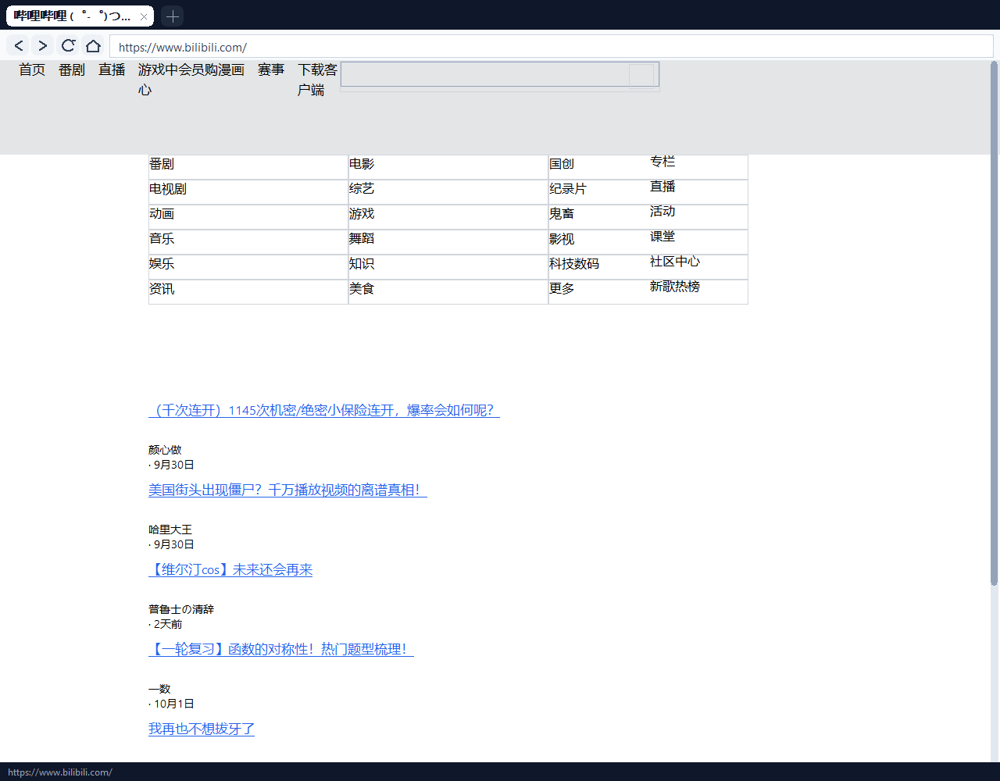

# Zero Browser

[](LICENSE)


**中文 | [English](README.en.md)**

**一个从零自研渲染内核的 Windows 浏览器（C++17 + Win32，无 Chromium）。**

不依赖 Chromium / Blink / Gecko / WebView / iframe，也没有嵌入 Electron / CEF 等任何现成浏览器组件。
HTML 解析、CSS 选择器与样式计算、盒模型布局、文本排版、页面绘制、浏览器外壳**全部由本项目自己实现**。
系统组件只被当作底层管道使用（传输、解码、出像素），且用途被严格限定，详见[系统边界](#系统边界)。


---

## 功能一览

### 静态排版、CSS 与浏览器外壳

多标签、地址栏、前进/后退/刷新、滚轮滚动、自绘滚动条与状态栏全部自绘。
地址栏是**自己实现的单行编辑框**：光标定位、按码点删除、选择区（拖动选择 /
`Shift`+方向键 / `Ctrl+A` / 双击全选）与剪贴板（`Ctrl+C/X/V`、`Shift+Insert`、
右键菜单）都在自绘外壳里完成。
CSS 支持标签 / 类 / id / 后代 / `>` / 逗号分组 / `*` / **属性选择器** / **结构伪类**，
布局支持块级文档流、行内文本换行（中文逐字断行）、flex 行与列（含默认的
`align-items: stretch` 等高拉伸）、**CSS Grid**、**`float` / `clear` 分栏**、
**`position: relative / absolute / fixed` + `z-index`**、表格行、列表、`<pre>`。
字号按 CSS 规则处理 `px` / `%` / `em` / `rem`（`rem` 基准跟随 `html` 的 `font-size`）。

### 图片与背景图（WIC 解码字节为像素）

`` 与 `background-image` 支持 PNG / JPEG / GIF / BMP、`width`/`height` 属性与 CSS 尺寸、
保持宽高比、`width:100%`、透明 PNG 合成、破图按 `alt` 绘制占位框；
`background-size` 支持 `cover / contain / auto / stretch` 并裁剪在盒内。


### 视频播放（Media Foundation 解码）

`<video>` / `<source>`，`autoplay` / `loop` / `muted` / `controls` 与宽高；
点击画面暂停/继续、点进度条跳转、点静音图标切换。
**未声明 `autoplay` 或暂停时也会先解出首帧作为海报帧**，不会是一块纯黑。
播放器画面、进度条、时间文本、按钮全部自研绘制。


### CSS Grid

`grid-template-columns` 支持 `px` / `%` / `fr` / `auto` / `repeat()` / `minmax()`，
`grid-column: span N`（含 `1 / 3` 写法）与 `gap`，自动按行流动放置。


### JavaScript（自研 ES5 子集解释器）

**没有引入 V8 / QuickJS / Duktape 等任何第三方引擎**，解释器自己实现，分文件如下：

| 文件 | 职责 |
| --- | --- |
| `src/js.cpp` | 词法分析与语法分析，产出语法树 |
| `src/js_eval.cpp` | 求值器：语句/表达式、作用域、调用与步数预算 |
| `src/js_builtins.cpp` | 内置方法表（按接收者类型分派） |
| `src/js_globals.cpp` | `Math` / `JSON` / `Date` / `Error` / `console` 等全局对象 |
| `src/js_dom.cpp` | DOM 绑定：`document` / 元素 / `window` / `location` / 事件 / 定时器 |
| `src/js.h`、`src/js_internal.h` | 对外接口与解释器内部接口 |

**语言特性**：`var` / `let` / `const`（**无块级作用域**，`let`/`const` 等价 `var`）、
函数声明 / 函数表达式 / 箭头函数、闭包、递归、变量与函数提升、对象与数组字面量、
计算属性名、模板字符串（**不支持 `${}` 插值**，遇到会明确报错）、
`for` / `for-in` / `for-of` / `while` / `do-while`、`switch` / `case` / `default`、
`try` / `catch` / `finally` / `throw`、`break` / `continue`、`++` / `--` / 复合赋值、
三元、`typeof` / `instanceof` / `in` / `delete` / `void`、位运算、宽松与严格相等。

**内置对象**：

| 对象 | 已实现 |
| --- | --- |
| `Object` | `keys` / `values` / `entries` / `assign` / `create` / `defineProperty` / `freeze` |
| `Array` | `push` / `pop` / `shift` / `unshift` / `slice` / `splice` / `concat` / `join` / `indexOf` / `lastIndexOf` / `includes` / `forEach` / `map` / `filter` / `some` / `every` / `find` / `findIndex` / `reduce` / `sort` / `reverse` / `toString`，静态 `isArray` / `from` / `of` |
| `String` | `charAt` / `charCodeAt` / `indexOf` / `lastIndexOf` / `includes` / `startsWith` / `endsWith` / `slice` / `substring` / `substr` / `toUpperCase` / `toLowerCase` / `trim` / `trimStart` / `trimEnd` / `split` / `replace` / `replaceAll` / `concat` / `repeat` / `padStart` / `padEnd` / `localeCompare`，静态 `fromCharCode` |
| `Number` | `toFixed` / `toString(radix)` / `isNaN` / `isFinite` |
| `Math` | `abs` / `floor` / `ceil` / `round` / `sqrt` / `pow` / `max` / `min` / `random` / `sin` / `cos` / `tan` / `log` / `exp` / `sign` / `trunc` 与 `PI` / `E` / `LN2` |
| `JSON` | `parse` / `stringify`（**遇环形引用报错**，不是无限递归） |
| `Date` | `now` / `parse` 与 `getTime` / `getFullYear` / `getMonth` / `getDate` / `getHours` / `getMinutes` / `getSeconds` / `getDay` / `toISOString` / `toString` |
| `Error` | `Error` / `TypeError` / `RangeError` / `ReferenceError` / `SyntaxError` |
| 全局函数 | `parseInt` / `parseFloat` / `isNaN` / `isFinite` / `String` / `Number` / `Boolean` / `Array` / `Object` / `Function` / `encodeURI(Component)` / `decodeURI(Component)` |
| 输出 | `console.log` / `info` / `warn` / `error` / `debug`、`alert`（**写进脚本日志**，不弹系统对话框） |

**DOM 绑定**：

- `document`：`getElementById` / `getElementsByTagName` / `getElementsByClassName` /
  `querySelector` / `querySelectorAll` / `createElement` / `createTextNode` /
  `write` / `writeln` / `body` / `head` / `documentElement` / `title` / `readyState` /
  `URL` / `cookie`（**只读**）/ `addEventListener`
- 元素：`tagName` / `id` / `className` / `classList.add·remove·toggle·contains` /
  `style.xxx` 与 `style.cssText` / `style.setProperty` / `innerHTML` / `outerHTML` /
  `textContent` / `innerText` / `children` / `childNodes` / `parentNode` /
  `nextSibling` / `previousSibling` / `firstChild` / `lastChild` /
  `appendChild` / `insertBefore` / `removeChild` / `replaceChild` /
  `setAttribute` / `getAttribute` / `removeAttribute` / `hasAttribute` /
  `getBoundingClientRect` / `offsetWidth` / `offsetHeight` / `offsetTop` / `offsetLeft` /
  `value` / `checked` / `href` / `src` / `click` / `addEventListener` / `querySelector…`
- `window`：`document` / `location` / `innerWidth` / `innerHeight` / `scrollY` /
  `scrollTo` / `addEventListener` / `getComputedStyle`（返回 `undefined`）
- `location`：`href` / `pathname` / `search` / `hash` / `host` / `hostname` / `protocol` /
  `origin` / `assign` / `replace` / `reload`

**事件**：`addEventListener` 与内联属性（`onclick="..."`）都支持，**会冒泡**到
`document` 与 `window`；事件对象有 `type` / `target` / `currentTarget` / `clientX` /
`clientY` / `preventDefault()` / `stopPropagation()` / `defaultPrevented`；
处理器返回 `false` 等价于 `preventDefault`；点击 `<a href>` 的默认动作会导航
（除非被 `preventDefault`）。
外壳把真实点击交给脚本：命中测试按布局树里的 run / 盒**反查 DOM 节点**
（自绘控件 `button` / `input` 是 run 而不是 Box，见踩坑第 33 条）。

**定时器**：`setTimeout` / `setInterval` / `clearTimeout` / `clearInterval` /
`requestAnimationFrame`，由外壳 **60ms 心跳**（`WM_TIMER`）驱动，**上限 512 个**。

**脚本执行**：内联 `<script>` 与外链 `<script src>` 都执行；**外链正文由导航线程与
图片一起并行取回，不阻塞 UI**；按文档顺序执行；首次布局完成后执行，
随后派发 `load` / `DOMContentLoaded`。

**安全与隔离**（这是本层最重要的设计）：

- 每段脚本**单独执行**，异常只记录、**不上抛**，绝不中断渲染
- **死循环**由步数预算掐断（**2000 万步 / 段**）
- **无限递归**由调用深度护栏拦住（**200 层** + 8MB 线程栈）
- `null.x`、调用非函数、语法错误都只影响该段脚本，页面继续渲染
- `JSON.stringify` 遇环形引用报错，而不是无限递归

> 这一层只做「真实站点常见脚本」的覆盖面，不追求完整语言规范。
> 语言、内置对象、DOM 与全局对象的缺口都逐条列在[尚未实现](#尚未实现)里。

### position 定位与 z-index

`relative` 在原位偏移；`absolute` 脱离文档流；`fixed` 相对视口定位、滚动时保持悬浮；
同层定位元素按 `z-index` 稳定排序绘制，命中测试与绘制使用同一套坐标换算。


> 上图是在 `--scroll 780`（已向下滚动 780px）下截的：页头已经滚出视口，
> 顶部固定导航栏与右下角固定悬浮块仍在视口原位，且盒内文字随盒一起定位。

### 表单控件

`input`（`text` / `password` / `submit` / `button` / `reset`）、`button`、`select`、`textarea`
按控件外观绘制，显示 `value` / `placeholder` / `option` 文本，并支持聚焦高亮。
`input[type="hidden"]` 与浏览器一致地不占布局（真实登录页的 CSRF 隐藏域不再顶歪页面）。


**交互**（自绘，不依赖系统 `EDIT` 控件）：

- 点控件获得键盘焦点，焦点与地址栏互斥；`Esc` 放弃焦点。
- 打字、`Backspace` / `Delete`、`←` / `→` / `Home` / `End` 按**码点**编辑文本。
- `Tab` / `Shift+Tab` 按 DOM 顺序在控件间移动焦点，循环回绕。
- `Enter`（或点击 `input[type=submit]` / `<button>`）提交所属 `<form>`：
  `GET` 拼查询串，`POST` 走请求体（`application/x-www-form-urlencoded`），
  字段按**文档顺序**编码，隐藏域照常提交，被按下的提交按钮追加在末尾，
  未勾选的 `checkbox` / `radio` 不提交。`<button type="button">` 不提交。

> `select` 目前只显示当前选项，**还没有下拉列表**；控件内点击定位插入点也还是
> 简单地把插入点放到末尾（用 `Home` / `End` / 左右键调整）。

### 真实站点

优化了资源加载（并行 + 会话复用）、CSS 解析（`@media` 嵌套块）、长度解析
（`max-content` / `calc()` / `vh` 等，之前会被解析成 0 导致整页宽度为 0），
再加上 **`float` 分栏**与 **`rem`/`em` 字号**之后，可以直接打开真实网站：

| 站点类型 | 结果 |
| --- | --- |
| 某大型视频站 | 顶部导航、频道分类**四列**、视频列表标题 / UP 主 / 日期均可读 |
| 某算法竞赛评测站 | 先识别并完成「JS 设置 Cookie 后重载」的反爬挑战，再渲染出 banner、倒计时、跳题框，以及**近期比赛 / 本站公告两栏** |




> 这里一律不写具体站点名——**发布说明、README 都不点名**，只说"某视频站""某评测站"。

> **某评测站有两套界面，看到哪一套很关键。** 它的 HTML 里同时有空的
> `<div id="app"></div>` 和装着旧服务器端标记的 `<div id="app-old">`（Amaze UI 栅格）。
> 主流浏览器展示的是 **Vue 3 渲染进 `#app` 的新界面**——那需要跑得动 235KB 的
> webpack 产物，本项目自研的 ES5 子集解释器做不到（没有 `Promise` / 模块 / 正则等），
> 所以本浏览器展示的是 **`#app-old` 这份旧标记**。**这是 JS 的能力边界，不是排版 bug。**
>
> 旧标记本身现在是**排版正常**的：它的 `.am-u-md-*` 栅格靠 `float: left` 分栏，
> 在实现 `float` 之前所有列都会退化成竖排块流、整页挤成一条窄栏。

> 这两张是**真实抓取**的结果，不是本地仿制页。版式仍比 Edge 粗糙，原因见
> [尚未实现](#尚未实现)：脚本子集覆盖面有限，也没有 `fetch` / `XHR`，因此强依赖接口
> 与完整语言特性的交互（登录、播放、无限下拉）仍然不可用。
>
> 截图随版本更新：**0.1.5 起**用当前构建重新抓取（已经有了 `float` 分栏与
> `rem`/`em` 字号）。0.1.4 起 `<script>` 会真正执行，见上面的
> [JavaScript 章节](#javascript自研-es5-子集解释器)。

---

## 系统边界

本项目只把系统能力当作“底层管道”，不承担任何排版/绘制决策：

| 系统组件 | 本项目如何使用 | 系统**不**负责 |
| --- | --- | --- |
| WinHTTP | HTTP/HTTPS 传输、重定向、gzip 解压 | HTML、CSS、布局、绘制 |
| Media Foundation | 视频/音频**解码**为帧与 PCM | 播放控制、时间轴、控件、上屏 |
| WASAPI | PCM 音频输出 | 解码、混音、播放逻辑 |
| WIC | `` / `background-image` 的**字节解码为 BGRA 像素** | 尺寸计算、缩放、裁剪、布局、合成位置 |
| GDI | 最终像素与文字输出、AlphaBlend 合成 | 排版决策、盒模型、图片缩放策略 |

一句话：**系统把字节变成像素/声音，其余全部自研。**

---

## 构建

需要一个带 `g++` 的 MinGW（开发机是 Embarcadero Dev-Cpp 自带的
`C:\Program Files (x86)\Embarcadero\Dev-Cpp\TDM-GCC-64`，TDM-GCC 9.2）。
`build.bat` 会优先用 `PATH` 里的 `g++`，找不到就按几个已知位置补进 `PATH`。

```bat
cd zero-browser
build.bat
```

一次产出**两个架构**：

```
build\zero-browser.exe       32 位（x86，PE32）   约 3.8 MB
build\zero-browser-x64.exe   64 位（x64，PE32+）  约 4.5 MB
```

脚本默认**静态链接**（`-static -static-libgcc -static-libstdc++`），产出单个免依赖 exe
（大小视工具链版本而定），除系统 DLL 外不需要额外运行库：

```
GDI32 / USER32 / KERNEL32 / msvcrt / ole32 / MSIMG32 / WINHTTP / MFPlat / MFReadWrite
```

链接库（`build.bat` 已包含）：`gdi32 winhttp mfplat mfuuid ole32 uuid strmiids ksuser
avrt windowscodecs msimg32`，外加 `mfreadwrite` 的导入库。

> 两个工具链差异要注意：
> - **`mfreadwrite` 的导入库不总是随 MinGW 一起装**。本项目只用到
>   `MFCreateSourceReaderFromByteStream` 一个导出，所以 `build.bat` 先用
>   `g++ --print-file-name=libmfreadwrite.a` 探测；TDM-GCC 的 multilib 只装了头文件、
>   没有这个 `.a`，于是回退到 Windows SDK 的同名导入库（`Windows Kits\10\Lib\<版本>\um\<架构>\`）。
> - `-D_WIN32_WINNT=0x0601`：老一点的 MinGW 头文件默认值偏低，不开这个
>   `GetTickCount64` 不会声明。
> - 链接前会先 `taskkill` 掉残留的 `zero-browser*.exe`：进程活着时链接会报
>   `cannot open output file ...: Permission denied`。

> `src\media.cpp` 与 `src\audio_out.cpp` 必须**分开编译**：MinGW 的 `ksmedia.h` 与 MF 的
> strmif 头会重复定义 `TIMECODE_SAMPLE` / `DDPIXELFORMAT`，详见[踩过的坑](#踩过的坑改动前请先读)。

---

## 运行

```bat
build\zero-browser.exe
build\zero-browser.exe http://info.cern.ch/hypertext/WWW/TheProject.html
build\zero-browser.exe https://example.com/
```

- 地址栏输入域名会自动补 `https://`
- 支持 `browser://home`、`browser://about`、`file:///...`、`data:text/html,...`、`http://`、`https://`
- 环境变量 `ZB_PROXY=http://host:port` 指定 HTTP 代理
- 环境变量 `ZB_KEEP_CONSOLE=1` 保留控制台窗口用于调试
- 编译时加 `-DZB_MEDIA_DEBUG` 打开媒体模块的 stderr 日志

本地验证页面：

```bat
python -m http.server 8765 --directory testpage
```

表单提交要能回显服务端收到了什么，所以另有一个探针服务器（静态目录一样是
`testpage/`，额外提供 `GET`/`POST /echo` 回显）：

```bat
python tools\form_server.py 8902
```

---

## 启动不了怎么排查

双击 exe 后如果 Windows 弹出 **「This app can't run on your PC」**，这句话来自 Windows
加载器，在任何浏览器代码执行之前就返回了 —— 它表示「这个可执行文件没能被加载」，
不是浏览器崩溃。按顺序检查：

1. **文件是不是完整的？** 在文件所在目录用 PowerShell 核对（大小与 SHA256 见
   [Releases](https://github.com/liumingyangrd/zero-browser/releases) 页面）：
   ```powershell
   $f = ".\zero-browser-v0.1.5-win32.exe"
   (Get-Item $f).Length                                          # 应为 3996442
   (Get-FileHash $f -Algorithm SHA256).Hash
   [BitConverter]::ToString([IO.File]::ReadAllBytes($f)[0..1])   # 应为 4D-5A（"MZ"）
   ```
   大小为 0、哈希不符、开头不是 `4D-5A`，都说明下载被截断或被替换（代理、杀软把拦截页
   存成了 .exe 等）——重新下载即可。实测踩到过一次：下载下来的是 **0 字节**文件。
2. **文件被锁定了吗？** 右键文件 → 属性 → 底部若有「解除锁定」就勾上；并把文件从
   OneDrive / 映射盘 / 压缩包预览里**复制到本地普通目录**（例如 `C:\zb\`）再运行。
3. **机器是 ARM 架构吗？** 32 位包是 `PE32 / i386`，64 位包是 `PE32+ / AMD64`。
   在 Windows on ARM 上跑 32 位包需要 x86 模拟层；模拟不可用或被策略关闭时，
   Windows 报的就是这句话。可在「设置 → 系统 → 关于 → 系统类型」查看。

## 诊断与取证

`--shot` 是无窗口渲染诊断模式：复用**真实的** `Render` / `OnLButtonDown` 代码路径，
把窗口内容画到内存 DC 再存成 BMP，因此在没有桌面窗口（或截图受限）的环境里也能取证。

```bat
:: 页面截图 + 打印布局树（文档坐标与屏幕坐标、盒内 runs、播放器状态）
::   注意 --dump-boxes 是在投递完 --click 之后才打印布局树，
::   目的是让 dump 反映点击后的最终状态；布局树的实时坐标以最后一次输出为准
build\zero-browser.exe --shot --url http://127.0.0.1:8765/video2.html ^
    --out build\shot.bmp --wait 3000 --size 1180x1240 --dump-boxes

:: 滚动到指定位置再截图（验证 position:fixed 是否保持悬浮）
build\zero-browser.exe --shot --url http://127.0.0.1:8765/position.html ^
    --out build\scrolled.bmp --scroll 780 --wait 1200 --size 1100x900

:: 依次投递真实点击（画面暂停 / 进度条跳转），再截第二张
build\zero-browser.exe --shot --url http://127.0.0.1:8765/video2.html ^
    --out build\a.bmp --out2 build\b.bmp ^
    --click 512,330 --click 678,493 --wait 1200 --after 600

:: --click / --type-field TEXT / --press NAME 按**命令行给出的顺序**统一排队执行，
:: 所以可以表达「点控件 → 打字 → 再点下一个 → 回车提交」这种多步流程。
:: --press 支持 tab / shift+tab / enter / escape / backspace / delete / left /
:: right / home / end。注意 --type 是地址栏专用的，测页面控件要用 --type-field。

:: 图片 / 背景图 / grid / 表单 / float 分栏
build\zero-browser.exe --shot --url http://127.0.0.1:8765/images.html   --out build\img.bmp --wait 1500 --size 1100x1900
build\zero-browser.exe --shot --url http://127.0.0.1:8765/grid.html     --out build\grid.bmp --wait 1200 --size 1100x1000 --dump-boxes
build\zero-browser.exe --shot --url http://127.0.0.1:8765/forms.html    --out build\forms.bmp --wait 1200 --size 900x760 --dump-boxes
::   float 分栏回归（期望 content_height=619；没有 float 时所有列会竖排，数值明显变大）
build\zero-browser.exe --shot --url http://127.0.0.1:8765/floats.html   --out build\floats.bmp --wait 1200 --size 1100x1200 --dump-boxes

:: 表单交互回归。--click / --type-field / --press 按命令行顺序执行，所以
:: 「点控件 → 打字 → 回车提交」是一条链。先开表单探针服务器：
python tools\form_server.py 8902
::   控件输入 + Tab 换焦点（期望每次 [form] press 的 node 依次为
::   input(text) → input(password) → textarea → select → button → input(submit)）
build\zero-browser.exe --shot --url http://127.0.0.1:8765/forms.html ^
    --out build\ft.bmp --wait 1500 --size 900x760 ^
    --click 311,240 --type-field "-OK" --press tab --press tab --press shift+tab
::   期望：[form] type-field value='zero-user-OK'；shift+tab 回到上一个控件
:: 回车提交 POST 表单（期望回显页出现
::   method=POST 与 body=csrf=tok-42&user=zero-user-X&pass=secret123&remember=1）
build\zero-browser.exe --shot --url http://127.0.0.1:8902/formsubmit.html ^
    --out build\fp.bmp --wait 1500 --size 900x900 --dump-boxes ^
    --click 311,203 --type-field "-X" --press enter
:: 点提交按钮提交（期望 body 末尾追加 &do=login —— 被按下的按钮带 name 才提交）
build\zero-browser.exe --shot --url http://127.0.0.1:8902/formsubmit.html ^
    --out build\fb.bmp --wait 1500 --size 900x900 --dump-boxes ^
    --click 311,203 --type-field "-X" --click 208,319
:: GET 表单（期望 query=q=%E8%87%AA%E7%A0%94%E5%86%85%E6%A0%B8-Y&go=%E6%90%9C%E7%B4%A2）
build\zero-browser.exe --shot --url http://127.0.0.1:8902/formsubmit.html ^
    --out build\fg.bmp --wait 1500 --size 900x900 --dump-boxes ^
    --click 311,499 --type-field "-Y" --click 512,499
:: <button type="button"> 不提交（期望输出里没有 [form] click-submit）
build\zero-browser.exe --shot --url http://127.0.0.1:8902/formsubmit.html ^
    --out build\fc.bmp --wait 1500 --size 900x900 --dump-boxes --click 286,319

:: 网络诊断（注意：URL 直接跟在 --net-test 后面；第三个参数可选，把正文导出成文件）
build\zero-browser.exe --net-test http://example.com/
build\zero-browser.exe --net-test https://example.com/ build\page.html

:: 地址栏输入回归（走真实的 OnChar / OnKey 路径，覆盖「输入即崩溃」这类问题）
::   --set-address "\empty"  表示清空地址栏
build\zero-browser.exe --shot --url browser://home --out build\addr.bmp --wait 300 ^
    --size 900x600 --set-address "\empty" --focus-address --type "http://a.cn"
::   期望：[address] typed=11 bytes=11 caret=11 hex=68 74 74 70 ...（且不崩溃）
build\zero-browser.exe --shot --url browser://home --out build\addr2.bmp --wait 300 ^
    --size 900x600 --set-address "a中b" --focus-address --backspace 3
::   期望：[address] backspace=3 bytes=1 caret=1（按 UTF-8 码点退格，不切坏汉字）

:: 地址栏剪贴板回归（--clipboard 先把文本写进系统剪贴板，--paste/--copy/--cut
:: 走真实的 Ctrl+V/C/X 分支）
build\zero-browser.exe --shot --url browser://home --out build\clip.bmp --wait 300 ^
    --size 900x600 --set-address "\empty" --focus-address ^
    --clipboard "https://example.com/path" --paste 1
::   期望：clipboard-set bytes=24 ok=1 / paste=1 bytes=24 caret=24
build\zero-browser.exe --shot --url browser://home --out build\clip2.bmp --wait 300 ^
    --size 900x600 --set-address "old-text-here" --focus-address ^
    --clipboard "new.example.com" --select-all --paste 1
::   期望：select-all sel=[0,13) / paste=1 bytes=15（粘贴会替换掉整个选择区）
build\zero-browser.exe --shot --url browser://home --out build\clip3.bmp --wait 300 ^
    --size 900x600 --set-address "https://cut.example.com/" --focus-address --select-all --cut
::   期望：cut bytes=0 caret=0 readback='https://cut.example.com/'

:: 快捷键回归（无窗口会话没有键盘，GetKeyState 恒为 0，--hotkey 把修饰键显式
:: 喂进真实的 OnKeyEx 分支）
build\zero-browser.exe --shot --url http://127.0.0.1:8765/index.html --out build\hk.bmp ^
    --wait 1500 --size 900x600 --hotkey ctrl+l
::   期望：hotkey ctrl+l focused=1 sel=[0,32)（聚焦并全选）
build\zero-browser.exe --shot --url http://127.0.0.1:8765/index.html --out build\hk2.bmp ^
    --wait 1500 --size 900x600 --set-address "half-typed" --focus-address --hotkey f5
::   期望：hotkey f5 focused=1 bytes=10 pending=2
::         （聚焦时 F5 仍然重载，而且不会丢掉正在输入的内容）

:: Cookie 端到端：先开本地 cookie 测试服务器
python tools\cookie_server.py 8899
:: 第一次请求吸收 Set-Cookie，第二次把 Cookie 发回 echo 接口
:: 期望输出：echo_body=Cookie: auth=abc123; pref=dark  且 jar_size=2
build\zero-browser.exe --cookie-test http://127.0.0.1:8899/set-auth http://127.0.0.1:8899/echo
```

BMP 里的 alpha 会补成 255，方便直接转 PNG 肉眼核对。

地址栏剪贴板回归的两个注意点：

- **`--clipboard` 会写系统剪贴板**（这是有意的，好让 `--paste` 读到真实内容）。
- **非 ASCII 不能走命令行参数**：`main(int, char**)` 收的是 ANSI 代码页字节，传中文
  进来会先被转成 GBK。要验证多字节文本，请用 `Set-Clipboard` 放好 UTF-8 文本，
  再只跑 `--paste` / `--copy`：
  ```powershell
  Set-Clipboard -Value "零浏览器.cn/路径"      # 22 字节 UTF-8
  build\zero-browser.exe --shot --url browser://home --out build\clip4.bmp ^
      --wait 300 --size 900x600 --set-address "\empty" --focus-address --paste 1 --copy
  :: 期望：paste=1 bytes=22 caret=22，随后 (Get-Clipboard) 与原文完全一致
  ```

选中高亮可以像素级核对：画在文字之下的高亮色是 `#bfdbfe`，统计地址栏一条
（y 44–74）里该颜色的像素数，有选择时应为数千、无选择时应为 0。

其他探针：

```bat
:: 引擎层全链路：解析 -> 布局 -> 媒体 -> 绘制，打印播放时间线与视频区域非黑像素数
g++ -std=c++17 -O2 -Isrc tools\page_media_probe.cpp src\engine.cpp src\gdi.cpp ^
    src\html.cpp src\network.cpp src\media.cpp src\audio_out.cpp src\image.cpp ^
    -o build\page_media_probe.exe -lgdi32 -lwinhttp -lmfplat -lmfreadwrite ^
    -lmfuuid -lole32 -luuid -lmmdevapi -lstrmiids -lksuser -lavrt ^
    -lwindowscodecs -lmsimg32
build\page_media_probe.exe http://127.0.0.1:8765/video2.html --seconds 4

:: 生成内容明显的测试片源（移动色块 + 帧号 + 进度条），避免“黑屏 = 播放失败”的误判
g++ -std=c++17 -O2 tools\make_clip.cpp -o build\make_clip.exe ^
    -lmfplat -lmfreadwrite -lmfuuid -lole32 -luuid -lgdi32 -lstrmiids
build\make_clip.exe testpage\anim.wmv 90 640 360 15

:: 直接检查解码出来的帧缓冲：尺寸、字节数、alpha 分布、顶/中/底行采样
:: （用来区分“解码问题 / 缓冲格式问题 / 合成问题”，见“踩过的坑”第 18 条）
g++ -std=c++17 -O2 -Isrc tools\frame_probe.cpp src\media.cpp src\audio_out.cpp ^
    src\network.cpp -o build\frame_probe.exe -lwinhttp -lmfplat -lmfreadwrite ^
    -lmfuuid -lole32 -luuid -lmmdevapi -lstrmiids -lksuser -lavrt
build\frame_probe.exe testpage\anim.wmv 2500
::   alpha: zero=230400 full=0 other=0   → 说明帧缓冲的 X 字节全是 0（历史坑）
::   修复后的期望值是 full=像素总数

:: 检查本工具链下 std::atomic<double> 的跨线程可见性（见“踩过的坑”）
g++ -std=c++17 -O2 tools\atomic_double_check.cpp -o build\atomic_check.exe
build\atomic_check.exe 2000

:: JS：内联与外链脚本、DOM 改写、定时器（无窗口也能跑，定时器由 WM_TIMER 驱动）
build\zero-browser.exe --shot --url http://127.0.0.1:8765/js.html --out build\js.bmp ^
    --wait 1500 --size 1100x900 --dump-boxes
::   期望：[js] 脚本数=1 失败=0，且能看到 item-A/B/C、count=3、interval-ticks=2 等脚本生成内容
:: 点击按钮（内联 onclick + addEventListener 都会触发）
build\zero-browser.exe --shot --url http://127.0.0.1:8765/js.html --out build\js2.bmp ^
    --wait 1200 --size 1100x900 --click 53,459 --dump-boxes
::   期望：clicks=1 与 clicked-target=BUTTON
:: 错误隔离：抛错 / 未定义函数 / 死循环之后，后续脚本与页面渲染都必须继续
build\zero-browser.exe --shot --url http://127.0.0.1:8765/jserr.html --out build\jserr.bmp --wait 2500 --dump-boxes
::   期望：[js] 脚本数=4 失败=3，第 4 段 ok=1，content_height 正常
:: 解释器自测（不依赖 DOM）
g++ -std=c++17 -O2 -Isrc tools\js_probe.cpp src\js.cpp src\js_eval.cpp src\js_builtins.cpp src\js_globals.cpp ^
    -o build\js_probe.exe -Wl,--stack,8388608
build\js_probe.exe tools\js_selftest.js
build\js_probe.exe --robust
```

> `--dump-boxes` 现在是**点击之后再打印布局树**（原来是先打印、后点击）。
> 顺序改了才好用 `--click` 验证事件处理器的效果：`[js] 脚本数=…`、
> `内联脚本 N ok=…`、`监听器=`、`定时器=` 这些统计都在 dump 之后输出，
> 页面上看到的文字也必须已经是点击后的内容。想只看点击前的布局，
> 去掉 `--click` 即可；同一文件里布局修复后旧的盒坐标会失效。

### 实测结论

- `http://example.com/`、`http://info.cern.ch/hypertext/WWW/TheProject.html` 抓取、排版、点击相对链接跳转
- 本地页面（含外链 `style.css`、HTML 实体、中文空格、列表、表格、`pre`、flex 卡片）完整渲染
- 视频：带 `autoplay` 自动播放；无 `autoplay` 显示首帧海报；点击暂停/继续；
  点进度条跳转（0.00 → 4.80）；点静音图标切换；`loop` 到 6 秒后回绕。
  **像素级验证**：截图里视频画面区非黑像素 12208/12324；
  `page_media_probe` 报告画面区（不含控件条）非黑像素 207107
- 图片：PNG / JPEG / GIF / 透明 PNG 解码绘制，flex 行内图片基线对齐，
  `width:100%` 保持宽高比，破图显示 `alt`，`background-size: cover / contain` 裁剪在盒内
- Grid：`repeat(3, 1fr)` 三列等宽、`180px 1fr 1fr` 固定列 + 等分列、`span 2` 跨列、`auto auto`
- flex 默认 `align-items: stretch`：内置主页四张卡片等高、卡片内链接对齐（改前高度各随内容）
- float 分栏：某评测站首页的 Amaze UI 栅格（`.am-g` + `.am-u-md-8` / `.am-u-md-4`）正确并排；
  改前所有列退化成竖排块流、整页挤成一条窄栏。同一次抓取里 `content_height` 从 5579 降到
  4694（竖着堆 → 并排）就是直接证据
- 字号：`1.4rem` / `.875em` / `80%` 按 CSS 规则解析；改前某评测站的公告栏字号塌到 1~2px、
  613 个字符 run 全挤在同一个 y 上糊成一团，修好后才恢复成可读的列表

> 真实站点的 `content_height` 会随站点内容变化，**不能当回归基准**。
> 上面两条只是"改对了"的旁证；确定性的回归用本地 `testpage/floats.html`
> （命令见 [诊断与取证](#诊断与取证)）。
- position：滚动 780px 后 fixed 导航栏与悬浮块仍在视口原位，盒内文字随盒定位
- 表单：`input` / `select` / `textarea` / `button` 渲染出正确尺寸与值，`input[type="text"]`
  的属性选择器只命中文本框（提交按钮保持自适应宽度）
- 表单提交端到端（`tools/form_server.py` + `testpage/formsubmit.html`，`--shot --dump-boxes`
  读服务端回显页）：回车提交 `POST` 得到
  `body=csrf=tok-42&user=zero-user-X&pass=secret123&remember=1`（**文档顺序**、隐藏域参与、
  未按下的按钮不带入），点提交按钮变成 `...&do=login`，`GET` 表单得到
  `query=q=%E8%87%AA%E7%A0%94%E5%86%85%E6%A0%B8-Y&go=%E6%90%9C%E7%B4%A2`，
  `<button type="button">` 不提交；`Tab` 依次经过
  `input(text) → input(password) → textarea → select → button → input(submit)`
- Cookie：`--cookie-test` 输出 `echo_body=Cookie: auth=abc123; pref=dark`，`jar_size=2`
- 网络：显式 `ZB_PROXY=http://127.0.0.1:7890` 可抓取 `http://example.com`
- **JavaScript**（`--shot` 无窗口实测，脚本内容与布局都按真实路径取证）：
  - `testpage/js.html`（DOM 改写 + `createElement`/`appendChild` + `forEach` + `JSON` +
    `setInterval` + 内联 `onclick` + `addEventListener`）：`[js] 脚本数=1 失败=0 监听器=1`，
    脚本生成的内容全部正常渲染——`item-A` / `item-B` / `item-C`、`count=3`、
    `joined=A|B|C`、`even-sum=6`、`interval-ticks=2`，`content_height=466`
  - 点击按钮（`--click 53,459`）后：`clicks=1`（内联 `onclick`）与
    `clicked-target=BUTTON`（`addEventListener` 里的 `e.target.tagName`）**同时出现**，
    说明内联属性与监听器都在同一次点击里被派发到了
  - `testpage/jserr.html`（故意抛错 + 未定义函数 + 死循环 + 后续脚本）：
    `[js] 脚本数=4 失败=3`，四段依次报
    `Error: 故意抛出的错误`、`Error: undefined 不是函数`、
    `Error: 脚本执行步数超限（疑似死循环），已中止`，
    **第 4 段仍 `ok=1`、页面 `content_height=140` 正常渲染**
  - `testpage/jsext.html` + `jsext.js`（外链）：`外链脚本 1 ok=1`，
    页面出现 `外链脚本已执行`、`ext-sum=60`、`ext-flag=true`，监听器=1
    （该页总共 2 段脚本：外链 + 内联，都是 `ok=1`）
  - 解释器自测：`tools/js_selftest.js` **139 条断言全过**（`SUMMARY passed=139 failed=0`）；
    `build\js_probe.exe --robust` **13 条健壮性用例全过**（死循环、无限递归、语法错误、
    `null` 属性、调用非函数、`catch` 恢复等）
  - 加了 JS 之后页面回归不受影响：index 577 / images 1861 / grid 467 / forms 469 /
    flexblocks 233 / video2 864 / position 1200 / floats 619
- **与 Edge 对标**（同一本地页面、同一窗口宽度，用 `tools/compare_render.py` 比行/列内容带）：
  第一条内容带位置**完全重合**（相对 y 22–40 vs Edge 22–40），后续每段高度差约 6px；
  字号按像素修正前，每行要高出 10–12px（根因是 `font-size` 被当成 pt 折算，见踩坑第 23 条）
- 本地页面回归（`--shot` 实测 content_height）：images 1861 / grid 467 / position 1200 /
  forms 469 / flexblocks 233 / video2 864 / index 577 / floats 619

> 如果 `https://` 抓取失败并报 `Win32 错误 12185`（`ERROR_WINHTTP_CANNOT_CONNECT`），
> 通常是**当前环境的网络策略阻断了 TLS/CONNECT**，不是浏览器代码问题；
> 在正常 Windows 上 WinHTTP 会完成 TLS。可以用 `ZB_PROXY` 指向本机代理绕过。

---

## 已实现

**HTML**
- 标签/属性解析、注释、DOCTYPE、字符实体（`&amp;` `&lt;` `&#x...`）、void 元素
- `<title>` / `<style>` / `<script>` / `<textarea>` 原始文本处理，标签与属性名大小写不敏感
- `<!doctype …>` / `<!-- … -->` / `<![CDATA[…]]>` 声明区整体跳过（大小写不敏感），UTF-8 BOM 自动剥掉

**JavaScript（自研 ES5 子集解释器，不依赖任何第三方引擎）**
- 语法：`var`/`let`/`const`、函数声明/表达式/箭头函数、闭包、递归、提升、
  对象/数组字面量与计算属性名、模板字符串（无 `${}` 插值）、
  `for`/`for-in`/`for-of`/`while`/`do-while`、`switch`、`try`/`catch`/`finally`/`throw`、
  `break`/`continue`、`++`/`--`/复合赋值、三元、`typeof`/`instanceof`/`in`/`delete`/`void`、
  位运算、宽松与严格相等
- 内置：`Object` / `Array` / `String` / `Number` / `Math` / `JSON` / `Date` /
  `Error` 家族 / `parseInt` / `parseFloat` / `isNaN` / `isFinite` /
  `String` / `Number` / `Boolean` / `Array` / `Object` / `Function` /
  `encodeURI(Component)` / `decodeURI(Component)` / `console.*` / `alert`（写脚本日志）
- DOM：`document` 查询与创建（`getElementById` / `querySelector(All)` / `createElement` …）、
  元素属性与 `classList` / `style` / `innerHTML` / `textContent` /
  `appendChild` / `insertBefore` / `removeChild` / `setAttribute` /
  `getBoundingClientRect` / `offset*`、`window` / `location`、事件（含冒泡）
- 事件：`addEventListener` 与内联 `onclick="…"`，冒泡到 `document` / `window`，
  返回 `false` 等价 `preventDefault`，`<a href>` 默认动作导航
- 定时器：`setTimeout` / `setInterval` / `clearTimeout` / `clearInterval` /
  `requestAnimationFrame`，外壳 60ms 心跳（`WM_TIMER`）驱动，上限 512 个
- 脚本：内联与外链 `<script src>`（外链由导航线程与图片并行取回，不阻塞 UI）、
  按文档顺序执行、首次布局后执行并派发 `DOMContentLoaded` / `load`
- 隔离：每段脚本单独执行、异常只记录不上抛；死循环由 2000 万步/段预算掐断，
  无限递归由 200 层调用深度护栏拦住

**字符集**
- 按 `Content-Type: charset=` 与 `<meta charset>` 自动把 GBK / GB2312 / GB18030 / Big5 /
  Shift-JIS / EUC-KR / Latin-1 等转成 UTF-8

**CSS**
- 选择器：标签、`.class`、`#id`、后代（含空格分隔与 `>` 写法，目前都按后代匹配）、逗号分组、`*`
- 属性选择器：`[attr]`、`[attr=v]`、`[attr^=v]`、`[attr$=v]`、`[attr*=v]`、`[attr~=v]`、`[attr|=v]`
- 结构伪类：`:first-child` `:last-child` `:only-child` `:nth-child(an+b|odd|even)`
  `:nth-last-child` `:first-of-type` `:last-of-type` `:nth-of-type` `:root` `:empty`
- 状态伪类（`:hover` `:focus` `:active` …）判为不匹配，避免规则永久生效
- **CSS 变量**：`--x: v` 定义与 `var(--x[, fallback])` 替换（含嵌套），现代站点靠它定义颜色/间距
- **`@media` / `@supports` 嵌套块**按桌面宽度分支解析（不再把整张样式表解析乱）
- 颜色：`#rgb` / `#rrggbb` / `#rgba` / `#rrggbbaa`、`rgb()` / `rgba()`、`hsl()` / `hsla()`、
  命名色；带透明度的值走 AlphaBlend 混合
- `!important` 去标记处理；声明按括号/引号安全拆分（`url(data:…;base64,…)` 不再切坏）
- 属性：`display`、`width`/`height`/`max-width`、`margin`/`padding`（简写与四边）、
  `border`/`border-radius`、`background`/`background-image`/`background-size`/
  **`background-repeat`/`background-position`**、
  `color`、`font-size`/`font-weight`（数值）/`font-style`/**`font-family`**/`font` 简写、
  `text-align`、**`line-height`（含 `normal`＝按字体真实度量）**、`letter-spacing`、
  `text-transform`、`white-space`、`gap`、`flex-direction`/`justify-content`/`align-items`、
  `grid-template-columns`/`grid-column`、`position`/`left`/`top`/`right`/`bottom`/`z-index`、
  **`box-shadow`**、**`opacity`**、`box-sizing`、`overflow`
- 长度单位：`px` / `%` / `em` / **`rem`** / **`vh`** / **`vw`** / `pt` / `cm` / `mm` / `in` / `ch`、
  **`calc()`**（支持加减与数字乘除）；`max-content`/`fit-content` 等关键字按 auto 处理

**布局**
- 块级文档流、行内文本换行（含中文逐字断行与英文单词换行）
- **行内内容与块级子元素按文档顺序交错排布**（行内内容形成匿名块盒，与浏览器一致）
- flex 行 / 列、margin auto 居中、表格行、列表项目符号、`<pre>` 保留空白
- CSS Grid：`px` / `%` / `fr` / `auto` / `repeat()` / `minmax()`、`grid-column: span N`、`gap`
- `position: relative` / `absolute` / `fixed`，`z-index` 分层绘制
- 行内图片与表单控件参与行高并按文本基线对齐

**绘制**
- 背景色、背景图（裁剪）、边框、圆角、文字、下划线、链接颜色、缩放位图（视频帧）、控件外观

**网络**
- HTTP/HTTPS（系统 TLS）、自动重定向、gzip/deflate、超时、错误页、`ZB_PROXY` 代理
- 页面 HTML / 外部 CSS / 图片 / 媒体请求自动携带 Cookie，并吸收 `Set-Cookie`
- Cookie jar：host/path 匹配、`Secure` / `HttpOnly` / `Max-Age` / `Expires`、同名覆盖

**浏览器外壳**
- 多标签、地址栏、前进/后退/刷新/主页、鼠标滚轮滚动、滚动条、链接点击、
  相对 URL 解析、异步加载状态与状态栏
- **地址栏编辑**：按点击位置定位插入点、拖动选择、`Shift`+`←/→/Home/End` 扩展选择、
  `Ctrl+A` 全选、`Ctrl+C/X/V` 与 `Shift+Insert` 剪贴板、右键菜单
  （剪切/复制/粘贴/全选）、`Delete`/`Backspace` 删除选择区
- **地址栏快捷键**：`Ctrl+L` / `F6` 聚焦并全选、`F5` / `Ctrl+R` 重载
  （地址栏聚焦时同样生效，且保留正在输入的内容）、`Esc` 放弃编辑、`Enter` 导航

**视频**
- `<video src>` / `<source src>`，`autoplay` / `loop` / `muted` / `controls` / `width` / `height`
- 自动播放、点击画面暂停/继续、点击进度条跳转、点静音图标切换静音
- 暂停或未声明 `autoplay` 时先解出首帧作为海报帧；暂停时画面中央绘制播放标记
- 画面/进度条/时间文本/按钮全部自研绘制，只有解码交给 Media Foundation

**图片**
- `` 与 `background-image` 通过 WIC 解码：PNG / JPEG / GIF / BMP
- `width`/`height` 属性、CSS 宽高、保持宽高比、`width:100%`
- 透明 PNG 半透明合成；破图按 `alt` 绘制占位框
- `background-size: contain / cover / auto / stretch`，裁剪在盒内
- **懒加载兜底**：`src` 为占位图时依次回退 `data-src` / `data-original` /
  `data-lazy-src` / `srcset`（大型视频站等站点的缩略图靠这个才出得来）
- 缩小用 HALFTONE 平滑缩放（与 Chromium 的缩略图观感一致），放大用 COLORONCOLOR 保边缘

**表单（渲染 + 交互）**
- `input`（`text`/`password`/`submit`/`button`/`reset`/`checkbox`/`hidden`）、
  `button`、`select`、`textarea`
- 显示 `value` / `placeholder` / 首个 `option` 文本，支持聚焦高亮与自适应宽度
- `input[type="hidden"]` 不占布局（CSRF 隐藏域不再顶歪页面）
- 点击聚焦、按码点编辑文本、`Tab`/`Shift+Tab` 换焦点
- `Enter` 或点击提交按钮提交 `<form>`：`GET` 查询串 / `POST` 请求体，
  字段按文档顺序编码，隐藏域参与提交，被按下的提交按钮追加在末尾

---

## 尚未实现

- **JavaScript 语言特性**：没有正则表达式（`/.../` 字面量不支持）、没有 `Promise` /
  `async` / `await`、没有生成器、没有 `class` 语法、没有解构赋值与展开运算符、
  模板字符串的 `${}` 插值不支持（遇到直接报错）、`Function` 构造器不编译代码、
  没有块级作用域（`let`/`const` 等价 `var`）。
  字符串是 **UTF-8 字节语义**（`length` 与下标按字节算，不是 UTF-16），
  但所有切片操作都会**吸附到码点边界**，所以不会切出乱码。
  不实现 GC：对象用引用计数，环形引用要等**整页销毁**时才回收。
  没有 `fetch` / `XMLHttpRequest`，脚本不能主动发请求
- **DOM 子集**：只实现常用子集，没有 `dataset` / `insertAdjacentHTML` / `cloneNode`、
  没有事件捕获阶段、`addEventListener` 不支持 `once` / `capture` 选项；
  `document.cookie` **只读**；`getComputedStyle` 返回 `undefined`；
  通过 `innerHTML` 插入的 `<style>` **不会生效**
- **脚本兜底仍保留**：懒加载缩略图的静态兜底（`src` 是占位图时回退 `data-src` /
  `data-original` / `data-lazy-src` / `srcset`）与**反爬挑战页**（识别「JS 设置 Cookie
  后重载」这一固定写法并模拟，某评测站就是靠它进去的）都还在，不因有了 JS 而删除
- **流媒体**：HLS / DASH / m3u8 分片拉流未实现，目前只支持直链媒体文件
- **表单交互还不完整**：能输入、能换焦点、能提交 `GET`/`POST`，但 `<select>` **没有
  下拉列表**（只显示当前选项）；控件内的插入点定位只做到"放到末尾"；不支持
  `enctype="multipart/form-data"`（文件上传）、`formnovalidate`、表单校验与 `:invalid`；
  `input[type=checkbox]` 点击不切换勾选状态
- **CSS 进阶**：`position: sticky`、`transform`/`transition`/`animation`、`flex-wrap`、
  `vertical-align`、伪元素 `::before`/`::after`（`@media` 已支持桌面宽度分支）
- **`float` 是有意简化的子集**：按"浮动盒同行并排、放不下换行、容器高度包含浮动
  （等价 clearfix）"实现，够跑通网格框架；但普通块流会**自动避让**浮动，而不是像
  严格 CSS 那样可以与之重叠，行内文字也还没有"绕排浮动图片"的效果。
  `clear` 属性被解析但未单独生效（块流一律避让）。
- **定位精度**：`absolute` 目前以**父盒 content box** 为基准，尚未严格实现"最近 positioned 祖先"
- **图片进阶**：GIF 动图只显示第一帧；`<canvas>`、`<svg>`、`srcset`、`object-fit` 未实现
- **状态与存储**：没有 localStorage、HTTP 缓存、下载管理、书签持久化
- **Cookie 界面**：已有基础 jar，但还没有查看/清除入口，也不做第三方 Cookie 与 SameSite 策略

---

## 架构说明

```
WinHTTP 传输 ──> html.cpp 解析 ──> DOM 树
                                    │
                        CollectStyleRules / DefaultRules
                                    │
                             ComputeStyle（css.h）
                                    │
                 PopulateBoxes ──> 盒子树（layout.h）
                                    │
          LayoutBox：块流 / 行内 / flex / grid / position
                                    │
                 PaintBox ──> GdiCanvas（32 位 DIB 段）
                                    │
                        BitBlt 到窗口（app.cpp 自绘外壳）
```

JavaScript 挂在这条链路的**两侧**：脚本在**首次布局完成后**按文档顺序执行，
通过 `js_dom.cpp` 读写同一棵 DOM 树（改写后重新布局、重绘），
事件与定时器再由外壳的 60ms `WM_TIMER` 心跳回到解释器：

```
DOM 树 <── js_dom.cpp（DOM/事件/定时器绑定）<── js_eval.cpp（求值器）
                                                     ↑
                                               js.cpp 语法分析
                                                     ↑
                                    js_builtins.cpp / js_globals.cpp（内置对象）
```

- 坐标约定：`屏幕坐标 = 视口原点 + 文档坐标 - 滚动量`；
  命中测试严格使用逆变换，绘制与点击共用同一套换算
- 命中测试的终点是 **DOM 节点**：按布局树里的 run / 盒反查节点，再把事件交给脚本
- `--shot` 复用上述真实路径，只是把窗口换成内存 DC，因此取证结果与实际渲染一致

---

## 目录结构

```
zero-browser/
  LICENSE                  MIT 许可证
  build.bat                构建脚本
  src/
    main.cpp               入口；--shot / --net-test / --cookie-test 诊断
    app.cpp / app.h        自绘外壳：标签页、地址栏、工具栏、滚动、点击、异步加载
    html.cpp / html.h      HTML tokenizer + tree builder + 实体解码 + 原始文本元素
    css.h                  选择器解析/匹配（含属性选择器、伪类）、样式与颜色解析
    engine.cpp / engine.h  DOM -> 盒模型 -> block/inline/flex/grid/position -> 绘制 -> 命中
    layout.h               Box / TextRun / LinkArea
    gfx.h                  画布抽象接口
    gdi.cpp / gdi.h        自管理画布（32 位 DIB 段）与文字/图片输出
    image.cpp / image.h    WIC 解码图片字节为 BGRA（含 alpha premultiply）
    network.cpp / .h       WinHTTP 传输层：重定向、gzip、字符集归一化、Cookie jar、代理
    js.cpp                 自研 JS 解释器的词法分析与语法分析
    js_eval.cpp            求值器：作用域、语句/表达式、调用与步数预算
    js_builtins.cpp        内置方法表（Object/Array/String/Number/Math/JSON/Date/…）
    js_globals.cpp         Math/JSON/Date/Error/console 等全局对象
    js_dom.cpp / js_dom.h  DOM 绑定：document/元素/window/location/事件/定时器
    js.h / js_internal.h   解释器对外接口与内部接口
    media.cpp / .h         Media Foundation 播放器（解码、时间轴、跳转）
    audio_out.cpp / .h     WASAPI 音频输出
  docs/screenshots/        README 截图（PNG）
  testpage/                本地验证页面（图片、grid、flex、float 分栏、position、表单、表单提交、视频、外链 CSS、JS）
  testmedia/               测试片源
  tools/                   探针与取证工具（含 cookie_server.py、form_server.py、js_probe.cpp、js_selftest.js）
```

---

## 踩过的坑（改动前请先读）

1. **画布位深必须显式指定。** `GdiCanvas` 早期用 `CreateCompatibleBitmap(dc_, ...)`，位深取决于传入的 DC。
   如果 DC 来自 `CreateCompatibleDC(nullptr)`（默认选中的是 1x1 单色位图），拿到的就是 **1bpp 单色位图**，
   彩色页面和视频帧会被整体抖动成黑白。现在统一改用 32 位 DIB 段。
2. **坐标系必须严格互逆。** 约定是 `屏幕坐标 = 视口原点 + 文档坐标 - 滚动量`。
   渲染端曾写成 `doc - viewport + scroll`（没加视口原点、滚动方向也反了），与命中测试相差 `2 * viewport.y`，
   结果页面顶部被裁掉、视频控件条与链接都点不中。改坐标系时务必同时检查 `PaintBox` 与 `OnLButtonDown`。
3. **`Length` 默认 `is_auto = true` 只适合 width/height。** `margin` / `padding` 必须显式置 0
   （用 `ZeroLength()`），否则每个块的左右 margin 都被当成 `auto`，所有固定宽度元素都会被错误居中。
4. **不要用 `std::atomic<double>` 传递播放位置/跳转请求。** 在 32 位 MinGW + `-O2` 下实测出现过
   跨线程写入不可见（进度条跳转不生效、Seek 后位置不更新），同一 `-O0` 构建正常。
   现在播放时钟改为互斥量保护的普通 `double`。布尔标志仍用 `std::atomic<bool>`。
5. **`media.cpp` 与 `audio_out.cpp` 必须分开编译。** MinGW 的 `ksmedia.h` 与 MF 的 strmif 头会重复定义
   `TIMECODE_SAMPLE` / `DDPIXELFORMAT`。WASAPI 的 GUID 在 `audio_out.cpp` 内自带一份定义，不要删。
6. **`Page` 有 `unique_ptr` 成员且声明了析构**，必须保留显式的 `Page(Page&&)` / `operator=`，否则
   `vector<TabState>` 无法编译。
7. **`windows.h` 要在 `gfx.h` 之前包含。** 否则 `DrawText` 会被 `DrawTextA/W` 宏影响，
   出现 “marked override but does not override”。
8. **纯空白文本节点不要生成空行。** HTML 源码里块级元素之间的换行/缩进是独立 Text 节点，
   如果直接 `TokenizeText`，`\n` 会被当成硬换行，产生一排空行盒，把后面的块子元素整体往下推
   （一个缩进层级最多可推近 100px）。现在 `TokenizeText` 只在“本节点已有实际单词”时才发硬换行，
   纯空白节点不占高度。`--shot` 里用 `--dump-boxes` 取实时盒坐标，布局修复后旧坐标会失效。
9. **块容器里的换行缩进文本节点要在收集行内内容时处理掉。** `.boxed>\n  ` 这种缩进，
   即使 `TokenizeText` 不产生硬换行，`pending_space` 也会在图片 piece 之后产出一个 `" "` run。
   规则是：**行内元素之间的空白保留成一个空格，块级边界处的空白丢弃，末尾空白一律丢弃**。
10. **背景图 `cover` / `contain` 必须裁剪到盒子内。** `background-size: cover` 把图缩到比
    盒子更大再居中，`oy` 可能为负；如果不先 `canvas->Clip(box)` 就直接 `DrawImage`，
    大图会溢出到相邻区域。绘制背景图前先裁剪、绘完 `ResetClip`。
11. **`WinHttpQueryHeaders` 枚举多个 `Set-Cookie` 在本机 MinGW 头下会漏。** MinGW 的
    `winhttp.h` 该函数最后一个参数是 `LPDWORD`（Windows SDK 是 `DWORD`），按索引轮询
    时只拿到第一个头。改用一次 `WINHTTP_QUERY_RAW_HEADERS_CRLF` 取回整段响应头，
    再自解析所有 `set-cookie:` 行，才能稳定拿到全部 Cookie。
12. **WIC `InitializeFromMemory` 参数是 `BYTE*`。** 给 `const uint8_t*` 会编译失败，
    需要 `const_cast<BYTE*>(data)`。WIC 只读不改这些字节，转换是安全的。
13. **块容器必须按文档顺序交错排布行内内容与块级子盒。** 早期实现是“先把所有行内内容排一遍，
    再排所有块级子元素”，结果 `label` / `input` 交替的表单里，**所有输入框都堆到容器顶部**，
    标签留在下面。现在连续的行内内容构成一个匿名块盒，按文档顺序与块级子元素交错。
14. **定位阶段移动盒子后必须整体平移盒内 runs。** `ApplyPositioning` 早期只改了 `rect` / `content`，
    盒内文字/图片仍是布局时的绝对坐标，于是 `fixed` 悬浮块的文字留在原地（看起来是个空框）。
    现在按 `content` 原点差整体平移整棵子树（`ShiftBoxSubtree`）。
15. **宽替换元素后面的行尾空格必须丢弃。** 否则空格放不下会另起一行，并继承上一行被图片撑大的
    行高，凭空多出整整一图高（918×561 的图后面多 561px）。`LayoutInlineInto` 里
    “放不下的空格直接 `continue`”就是这条规则。
16. **属性选择器不能忽略。** 早期选择器解析直接跳过 `[...]`，于是 `input[type="text"] { width:320px }`
    会被当成 `input { width:320px }`，把提交按钮也撑成 320 宽。现在完整解析 `[attr]` 与各类比较运算符，
    并让状态伪类（`:hover` / `:focus`）判定为不匹配。
17. **`grid-template-columns` 的 track 分隔符是空格，不是逗号。** 只有 `repeat()` / `minmax()`
    参数里才是逗号；按逗号拆分会把 `120px 1fr` 当成一个 track（表现为只有一列，子项全宽堆叠）。
18. **Media Foundation 的 RGB32 实际是 BGRX，X 字节不保证是 255。** 实测整帧 alpha 全是 0，
    而本引擎用**预乘 AlphaBlend** 合成，alpha=0 会让整帧完全透明——表现就是 `<video>` 一直是纯黑，
    但播放器状态、`has_frame`、帧尺寸全都“正常”。拷贝帧时统一把 alpha 补成 255。
    `tools/frame_probe.cpp` 就是用来一眼看穿这件事的（打印 alpha 分布与顶/中/底行采样）。
19. **“视频区域非黑像素数”这类指标必须排除控件条。** 控件条本身就有上万个非黑像素，
    画面全黑时也会显示“有内容”，让人误判成播放正常。`page_media_probe` 现在只统计画面区
    （视频盒高度减掉 34px 控件条）。
20. **加 `display:grid` 分支时不要把 `display:flex` 分支挤掉。** 本项目按 `display` 分派
    `LayoutFlexRow` / `LayoutColumn` / `LayoutGrid` / `LayoutBlockFlow`，几个分支都写在
    `LayoutBox` 开头。曾经在插入 grid 分支时把整段 flex 分支替换掉，结果所有 flex 容器
    （包括内置主页的卡片行）都退化成竖排块流。`testpage/flexblocks.html` 就是守这条的回归页。
21. **绝对不要用 PowerShell 的 `Get-Content` / `Set-Content` 批量改 UTF-8 源码。**
    Windows PowerShell 5.1 默认按系统 ANSI（本机为 GBK）解码无 BOM 文件：中文注释会先变成
    乱码，更糟的是「汉字第三字节 + 紧跟的 ASCII(<0x40)」会被当成非法 GBK 双字节对**整体吃掉**，
    于是换行、`<`、`/`、`"` 这些字节凭空消失——注释把下一行代码吞进注释、字符串字面量丢引号，
    编译报一堆莫名其妙的错。批量替换请用编辑器/补丁工具，或用显式 `[System.IO.File]::ReadAllText`
    （UTF-8）+ `WriteAllBytes`。若已中招：这类损坏可逆，把文件按 GBK 解码、再按 UTF-8 写回即可
    去掉乱码，剩余少量丢字节的位置（特征是「汉字前两字节 + `?`」）按上下文补回即可。
22. **UTF-8 辅助函数里最容易踩的是 `size_t` 下溢，而不是编码本身。**
    曾经的写法是：
    ```cpp
    if (i > s.size()) i = s.size();   // 空串时 i 被钳成 0
    size_t j = i - 1;                 // 0 - 1 下溢成 SIZE_MAX
    while (j > 0 && ((unsigned char)s[j] & 0xC0) == 0x80) j--;   // s[SIZE_MAX] 越界读
    ```
    这个函数在**每次按键**时都会被调用（把光标吸附到码点边界），于是「地址栏为空时一输入就
    崩溃」——因为它会从 `data()-1` 一路向前扫，直到踩到未映射内存。修法是先挡空串与 `i == 0`，
    并把「吸附边界」拆成独立函数（`Utf8SnapToBoundary`），不要再借用 `Utf8PrevIndex` 去实现它；
    顺带还修掉了「字符被插到最后一个字符前面」的错位。回归手段：
    `--set-address "\empty" --focus-address --type "http://a.cn"` 必须输出 `hex=68 74 74 70 ...` 且不崩溃。
23. **CSS 的 `font-size` 是像素，不是点。** `CreateFontW` 的高度参数是“字符高度（em）”，
    早期写成 `-MulDiv(font_size, dpi, 72)`，在 96 DPI 下 16px 被放大成 21px 的 em，
    于是**所有文字比 Chromium 大 30%**、行高整体偏大（对标 Edge 时表现为每行高 10–12px）。
    正确写法是 `-MulDiv(font_size, dpi, 96)`，标准 DPI 下就是 `-font_size`。
24. **受限环境里 `MFCreateTempFile` 会返回 `E_ACCESSDENIED`（0x80070005）。**
    现象是网络视频播放失败、错误只有一句“无法创建媒体临时文件”——所以错误信息一定要带
    `HRESULT`。修法是失败时自己用 `CreateFileW` 写缓存文件再 `MFCreateFile` 打开，
    并在播放器 `Close()` 时删除（实测运行前后临时目录文件数都是 0）。
    注意 MinGW 的 `mfplat` 导入库里**没有** `MFCreateMFByteStreamOnStream` 这个符号，
    想用内存流方案会链接失败（`undefined reference to ...@8`）。
25. **地址栏聚焦时，`OnKey` 里所有全局快捷键都会被吞掉。** 原来的写法是
    `if (address_focused_) { ...处理编辑键...; return; }` 放在最前面，于是只要光标在
    地址栏里，`F5` / `Ctrl+R` / `Ctrl+L` 全部无效（既不重载也不聚焦）。
    正确顺序是**先处理全局快捷键、再进编辑分支**。同理，`F5` 重载不能把地址栏里
    正在输入的内容冲掉：`NavigateTo` 会主动失焦并同步 URL，所以重载前要先存后还原。
26. **剪贴板文本必须先去换行再插入地址栏。** 复制来的文本常带尾随 `\r\n`，
    直接拼进 URL 会让 `WinHttpOpen` 拿到带换行的地址（导航失败，或请求行被污染）。
    读剪贴板时要一并丢掉 C0/C1 控制字符与 U+2028/2029；另外 `CF_TEXT` 回退分支
    要按 `CP_ACP` 转换，且**缓冲必须开 `n` 个 `wchar_t`**——字符串开 `n-1` 再让 API
    写 `n` 个（含结尾 `\0`）会越界一个 `wchar_t`。
27. **写剪贴板时 `SetClipboardData` 成功后内存归系统所有。** 成功还去 `GlobalFree`
    就是双重释放；只有失败时才由本进程释放。另外 `CF_TEXT` 只是回退项，
    优先用 `CF_UNICODETEXT`，否则中文会按 ANSI 代码页走一圈。
28. **窗口类不加 `CS_DBLCLKS` 就收不到 `WM_LBUTTONDBLCLK`。** 双击全选需要它；
    同理，自绘编辑框不是 `EDIT` 控件，`WM_PASTE` / `WM_COPY` / `WM_CUT`
    必须自己接（输入法、无障碍工具只发这三条消息）。
29. **命令行参数不是 UTF-8。** `main(int, char**)` 拿到的是 ANSI 代码页字节，
    用 `--clipboard "中文"` 这类参数做回归会先被转成 GBK，然后被当成 UTF-8 解释而乱码。
    `--shot` 的无窗口会话里 `GetKeyState` 也恒为 0，所以 `--hotkey` / `--paste`
    必须把修饰键**显式传参**，否则测的根本不是用户按下的那条分支。
30. **`Env`（作用域链）如果是值语义，闭包捕获的就是快照而不是活绑定。**
    早期实现里作用域环境按值拷贝，于是 `var total=0; arr.forEach(function(x){ total += x; })`
    里的 `total` 永远是 0，`for` 循环体里对外层变量的赋值也不算数。
    修法是让变量表用 `shared_ptr` 持有并对外暴露成引用成员：拷贝一个 `Env`
    **等于同一作用域的另一个句柄**，写进去的绑定所有闭包都看得见。
31. **交互式解释器里"抛错本身也要花步数"会造成无限递归。**
    步数超限后如果继续抛"带 `toString` 的错误对象"，错误格式化会走
    `CallFunction` → `JsCall` → `BumpSteps`，于是再次超限、再次格式化，形成
    `CallFunction` → `ToPrimitive` → `ToString` → `CallFunction` 的无限递归
    （实测直接爆栈，进程崩溃）。修法：超限后**只抛纯字符串值**，
    并且错误文本用**不回调 JS** 的安全格式化（直接读 `name` / `message` 属性，见 `ErrorText`）。
32. **`<!doctype html>` 曾被当成正文渲染出来。** 解析器原来只认大写 `<!DOCTYPE`，
    而真实页面普遍写小写，于是每个页面顶部多出一行文字。
    修法：对所有 `<!` 开头的声明区（含 `<!-- -->` 与 `<![CDATA[]]>`）都整体跳过，
    **大小写不敏感**；同时剥掉 **UTF-8 BOM**（记事本"另存为 UTF-8"默认带 BOM，
    不剥也会把 `<!doctype` 顶成正文）。
33. **自绘控件是 `TextRun` 而不是 `Box`，命中测试只走盒树就永远点不中按钮。**
    `NodeAt` 必须同时检查盒内的 run，并把 run 关联的 DOM 节点作为更精确的命中结果返回
    （本次给 `TextRun` 加了 `node` 字段）；否则 `--click` 与真实点击都派发不到 `<button>` 上。
34. **剪贴板可能被别的进程占用。** `OpenClipboard` 失败时 `GetLastError` 是 5（拒绝访问），
    此时连 PowerShell 自己的 `Set-Clipboard` 也会失败。程序必须把这种情况当
    **"操作失败"如实报告**，而不是崩溃或静默写坏数据。
35. **`font-size` 不能把 `1.4rem` 当成"1.4 取整"。** 原来的实现是
    `(int)std::atof(value)`，于是 `1.4rem` → `1px`、`1.6rem` → `1px`、`2em` → `2px`：
    整站正文塌成一两个像素、几百行文字在同一个 y 上叠成一团黑。
    某评测站用的那套网格框架里 `1.4rem` 出现 30 次，公告栏直接糊掉。必须按 CSS 规则区分
    `px` / `%` / `em` / `rem`，而且 `rem` 的基准要真的跟随 `html` 的 `font-size`
    （页面常写 `html{font-size:62.5%}`）。顺手去掉了一个 GNU 扩展 `?:`——
    MSVC 编译不过。
36. **`float` 不是"可选特性"，是很多站点的地基。** Bootstrap 时代与 Amaze UI
    这一代网格框架全靠 `float: left` + 百分比宽度分栏，再用 `:before/:after`
    的 clearfix 让父容器包含浮动。缺了 `float`，`.am-u-md-8` / `.am-u-md-4`
    这类列会全部退化成竖排块流，整页挤成一条窄栏 —— 看起来像"排版崩了"，
    实际只差这一个属性。同理，浮动之后的**行内内容**也要先让位，
    否则会直接画在浮动上面（两段文字叠在一起）。
37. **`align-items` 的默认值是 `stretch`，不是"什么都不做"。** flex 行只实现了
    `center` / `flex-end`，默认值没走任何分支，于是卡片高度各随内容。
    内置主页那四张卡片和卡片里的链接会因此错开一截，是打开浏览器第一眼就看得到的差异。
38. **`textarea` 的初值来自它的文本子节点，`input[type=hidden]` 不占布局。**
    `CollectInline` 里 `textarea` 分支原来不设 `widget_value`，`<textarea>正文</textarea>`
    渲染成空框；隐藏域则被当成普通控件排版，一个 CSRF token 就撑出 74×28 的空白。
    勾选类控件（`checkbox`/`radio`）也一样：不能落进"白底+边框+文字"那条通用输入框
    分支，否则会把 `value="1"` 当文字画在框里。

---

## 许可证

本项目采用 **MIT** 许可证，详见 [LICENSE](LICENSE)。

- 项目处于早期阶段，目标是尽量对齐真实浏览器的排版行为，欢迎通过 issue 反馈渲染差异
