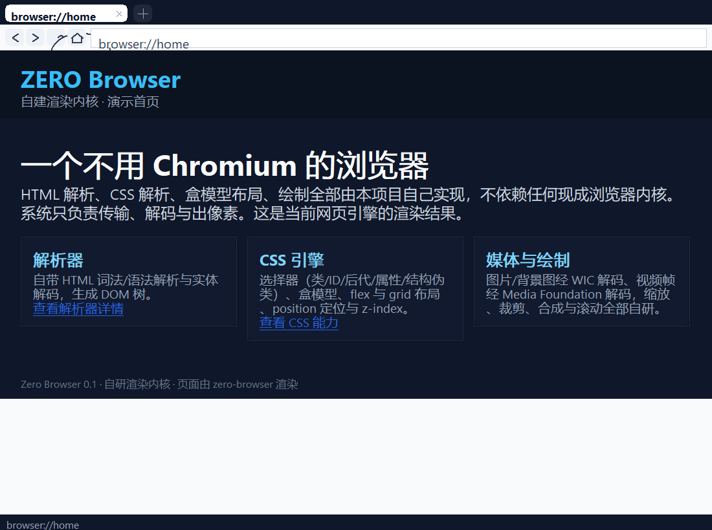
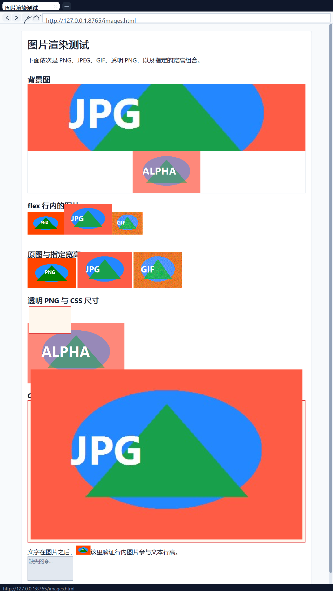
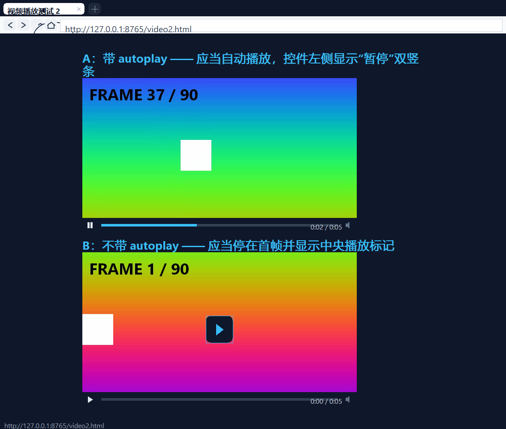
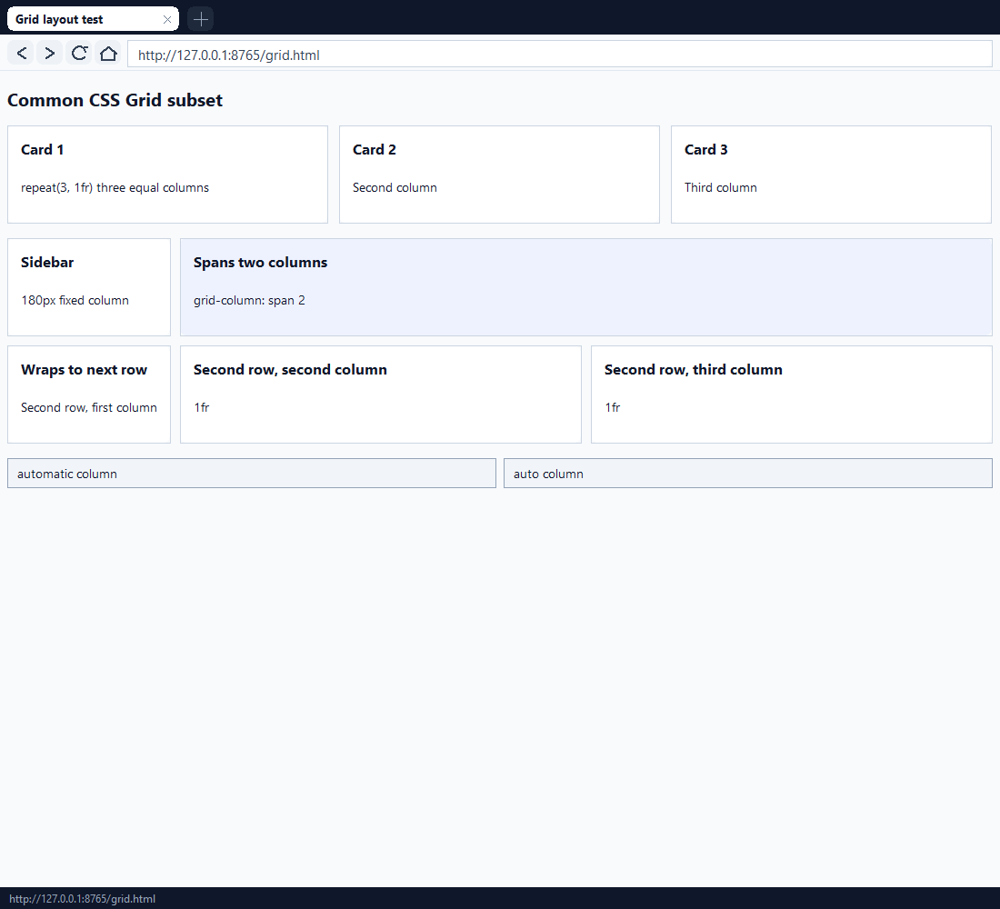
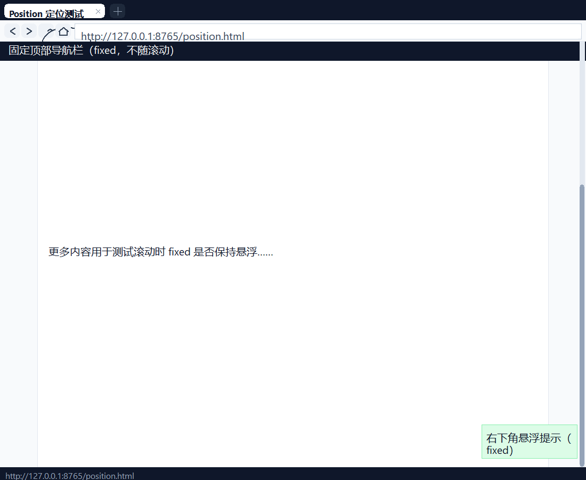
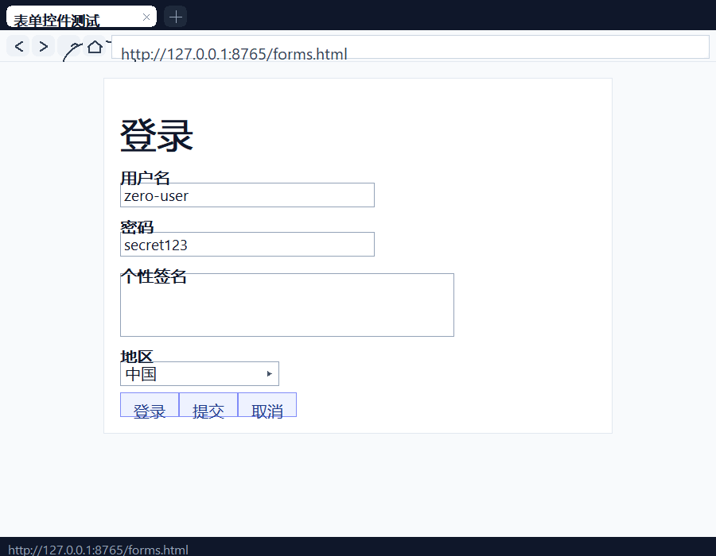
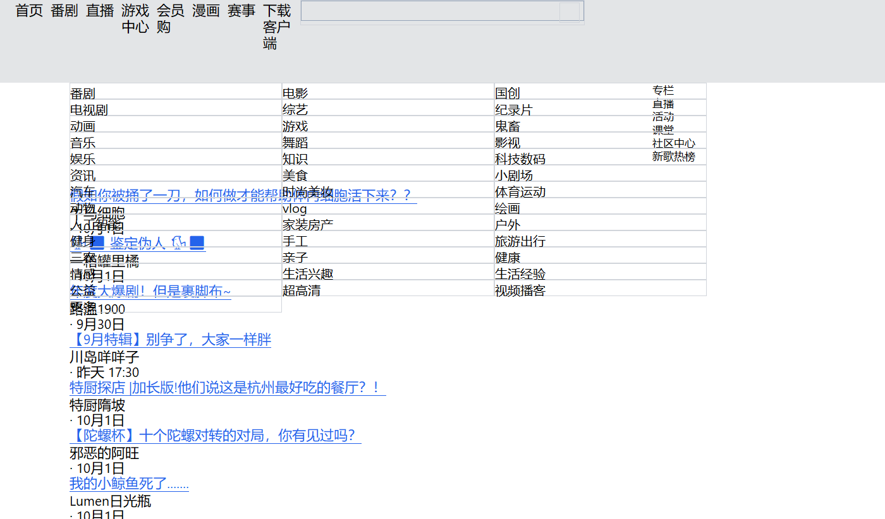

# Zero Browser

[](LICENSE)


**一个从零自研渲染内核的 Windows 浏览器（C++17 + Win32，无 Chromium）。**

不依赖 Chromium / Blink / Gecko / WebView / iframe，也没有嵌入 Electron / CEF 等任何现成浏览器组件。
HTML 解析、CSS 选择器与样式计算、盒模型布局、文本排版、页面绘制、浏览器外壳**全部由本项目自己实现**。
系统组件只被当作底层管道使用（传输、解码、出像素），且用途被严格限定，详见[系统边界](#系统边界)。



---

## 功能一览

### 静态排版、CSS 与浏览器外壳

多标签、地址栏、前进/后退/刷新、滚轮滚动、自绘滚动条与状态栏全部自绘。
CSS 支持标签 / 类 / id / 后代 / `>` / 逗号分组 / `*` / **属性选择器** / **结构伪类**，
布局支持块级文档流、行内文本换行（中文逐字断行）、flex 行与列、**CSS Grid**、
**`position: relative / absolute / fixed` + `z-index`**、表格行、列表、`<pre>`。

### 图片与背景图（WIC 解码字节为像素）

`` 与 `background-image` 支持 PNG / JPEG / GIF / BMP、`width`/`height` 属性与 CSS 尺寸、
保持宽高比、`width:100%`、透明 PNG 合成、破图按 `alt` 绘制占位框；
`background-size` 支持 `cover / contain / auto / stretch` 并裁剪在盒内。



### 视频播放（Media Foundation 解码）

`<video>` / `<source>`，`autoplay` / `loop` / `muted` / `controls` 与宽高；
点击画面暂停/继续、点进度条跳转、点静音图标切换。
**未声明 `autoplay` 或暂停时也会先解出首帧作为海报帧**，不会是一块纯黑。
播放器画面、进度条、时间文本、按钮全部自研绘制。



### CSS Grid

`grid-template-columns` 支持 `px` / `%` / `fr` / `auto` / `repeat()` / `minmax()`，
`grid-column: span N`（含 `1 / 3` 写法）与 `gap`，自动按行流动放置。



### position 定位与 z-index

`relative` 在原位偏移；`absolute` 脱离文档流；`fixed` 相对视口定位、滚动时保持悬浮；
同层定位元素按 `z-index` 稳定排序绘制，命中测试与绘制使用同一套坐标换算。



> 上图是在 `--scroll 780`（已向下滚动 780px）下截的：页头已经滚出视口，
> 顶部固定导航栏与右下角固定悬浮块仍在视口原位，且盒内文字随盒一起定位。

### 表单控件

`input`（`text` / `password` / `submit` / `button` / `reset`）、`button`、`select`、`textarea`
按控件外观绘制，显示 `value` / `placeholder` / `option` 文本，并支持聚焦高亮。



> 当前只做到**渲染**：还不能在输入框里打字、不能提交表单（见[尚未实现](#尚未实现)）。

### 真实站点

优化了资源加载（并行 + 会话复用）、CSS 解析（`@media` 嵌套块）、长度解析
（`max-content` / `calc()` / `vh` 等，之前会被解析成 0 导致整页宽度为 0）之后，
可以直接打开真实网站并读到内容：

| 站点 | 结果 |
| --- | --- |
| **B 站** `https://www.bilibili.com/` | 顶部导航、频道分类、视频卡片标题 / UP 主 / 日期均可读 |
| **洛谷** `https://www.luogu.com.cn/` | 先识别并完成「JS 设置 Cookie 后重载」的反爬挑战，再渲染出 banner、倒计时、题单入口 |




> 这两张是**真实抓取**的结果，不是本地仿制页。版式仍比 Edge 粗糙，原因见
> [尚未实现](#尚未实现)：CSS 变量 `var()` 尚未支持、没有 JS，因此依赖脚本的
> 交互（登录、播放、缩略图懒加载）仍然不可用。

---

## 系统边界

本项目只把系统能力当作“底层管道”，不承担任何排版/绘制决策：

| 系统组件 | 本项目如何使用 | 系统**不**负责 |
| --- | --- | --- |
| WinHTTP | HTTP/HTTPS 传输、重定向、gzip 解压 | HTML、CSS、布局、绘制 |
| Media Foundation | 视频/音频**解码**为帧与 PCM | 播放控制、时间轴、控件、上屏 |
| WASAPI | PCM 音频输出 | 解码、混音、播放逻辑 |
| WIC | `` / `background-image` 的**字节解码为 BGRA 像素** | 尺寸计算、缩放、裁剪、布局、合成位置 |
| GDI | 最终像素与文字输出、AlphaBlend 合成 | 排版决策、盒模型、图片缩放策略 |

一句话：**系统把字节变成像素/声音，其余全部自研。**

---

## 构建

需要 32 位 MinGW g++（开发机为 `D:\Dev-Cpp\MinGW32`，g++ 10.2）。

```bat
cd zero-browser
build.bat
```

产物：`build\zero-browser.exe`

脚本默认**静态链接**（`-static -static-libgcc -static-libstdc++`），产出单个免依赖 exe
（约 2.7 MB），除系统 DLL 外不需要额外运行库：

```
GDI32 / USER32 / KERNEL32 / msvcrt / ole32 / MSIMG32 / WINHTTP / MFPlat / MFReadWrite
```

链接库（`build.bat` 已包含）：`gdi32 winhttp mfplat mfreadwrite mfuuid ole32 uuid mmdevapi
strmiids ksuser avrt windowscodecs msimg32`。

> `src\media.cpp` 与 `src\audio_out.cpp` 必须**分开编译**：MinGW 的 `ksmedia.h` 与 MF 的
> strmif 头会重复定义 `TIMECODE_SAMPLE` / `DDPIXELFORMAT`，详见[踩过的坑](#踩过的坑改动前请先读)。

---

## 运行

```bat
build\zero-browser.exe
build\zero-browser.exe http://info.cern.ch/hypertext/WWW/TheProject.html
build\zero-browser.exe https://example.com/
```

- 地址栏输入域名会自动补 `https://`
- 支持 `browser://home`、`browser://about`、`file:///...`、`data:text/html,...`、`http://`、`https://`
- 环境变量 `ZB_PROXY=http://host:port` 指定 HTTP 代理
- 环境变量 `ZB_KEEP_CONSOLE=1` 保留控制台窗口用于调试
- 编译时加 `-DZB_MEDIA_DEBUG` 打开媒体模块的 stderr 日志

本地验证页面：

```bat
python -m http.server 8765 --directory testpage
```

---

## 诊断与取证

`--shot` 是无窗口渲染诊断模式：复用**真实的** `Render` / `OnLButtonDown` 代码路径，
把窗口内容画到内存 DC 再存成 BMP，因此在没有桌面窗口（或截图受限）的环境里也能取证。

```bat
:: 页面截图 + 打印布局树（文档坐标与屏幕坐标、盒内 runs、播放器状态）
build\zero-browser.exe --shot --url http://127.0.0.1:8765/video2.html ^
    --out build\shot.bmp --wait 3000 --size 1180x1240 --dump-boxes

:: 滚动到指定位置再截图（验证 position:fixed 是否保持悬浮）
build\zero-browser.exe --shot --url http://127.0.0.1:8765/position.html ^
    --out build\scrolled.bmp --scroll 780 --wait 1200 --size 1100x900

:: 依次投递真实点击（画面暂停 / 进度条跳转），再截第二张
build\zero-browser.exe --shot --url http://127.0.0.1:8765/video2.html ^
    --out build\a.bmp --out2 build\b.bmp ^
    --click 512,330 --click 678,493 --wait 1200 --after 600

:: 图片 / 背景图 / grid / 表单
build\zero-browser.exe --shot --url http://127.0.0.1:8765/images.html   --out build\img.bmp --wait 1500 --size 1100x1900
build\zero-browser.exe --shot --url http://127.0.0.1:8765/grid.html     --out build\grid.bmp --wait 1200 --size 1100x1000 --dump-boxes
build\zero-browser.exe --shot --url http://127.0.0.1:8765/forms.html    --out build\forms.bmp --wait 1200 --size 900x760 --dump-boxes

:: 网络诊断（注意：URL 直接跟在 --net-test 后面；第三个参数可选，把正文导出成文件）
build\zero-browser.exe --net-test http://example.com/
build\zero-browser.exe --net-test https://www.bilibili.com/ build\bili.html

:: 地址栏输入回归（走真实的 OnChar / OnKey 路径，覆盖「输入即崩溃」这类问题）
::   --set-address "\empty"  表示清空地址栏
build\zero-browser.exe --shot --url browser://home --out build\addr.bmp --wait 300 ^
    --size 900x600 --set-address "\empty" --focus-address --type "http://a.cn"
::   期望：[address] typed=11 bytes=11 caret=11 hex=68 74 74 70 ...（且不崩溃）
build\zero-browser.exe --shot --url browser://home --out build\addr2.bmp --wait 300 ^
    --size 900x600 --set-address "a中b" --focus-address --backspace 3
::   期望：[address] backspace=3 bytes=1 caret=1（按 UTF-8 码点退格，不切坏汉字）

:: Cookie 端到端：先开本地 cookie 测试服务器
python tools\cookie_server.py 8899
:: 第一次请求吸收 Set-Cookie，第二次把 Cookie 发回 echo 接口
:: 期望输出：echo_body=Cookie: auth=abc123; pref=dark  且 jar_size=2
build\zero-browser.exe --cookie-test http://127.0.0.1:8899/set-auth http://127.0.0.1:8899/echo
```

BMP 里的 alpha 会补成 255，方便直接转 PNG 肉眼核对。

其他探针：

```bat
:: 引擎层全链路：解析 -> 布局 -> 媒体 -> 绘制，打印播放时间线与视频区域非黑像素数
g++ -std=c++17 -O2 -Isrc tools\page_media_probe.cpp src\engine.cpp src\gdi.cpp ^
    src\html.cpp src\network.cpp src\media.cpp src\audio_out.cpp src\image.cpp ^
    -o build\page_media_probe.exe -lgdi32 -lwinhttp -lmfplat -lmfreadwrite ^
    -lmfuuid -lole32 -luuid -lmmdevapi -lstrmiids -lksuser -lavrt ^
    -lwindowscodecs -lmsimg32
build\page_media_probe.exe http://127.0.0.1:8765/video2.html --seconds 4

:: 生成内容明显的测试片源（移动色块 + 帧号 + 进度条），避免“黑屏 = 播放失败”的误判
g++ -std=c++17 -O2 tools\make_clip.cpp -o build\make_clip.exe ^
    -lmfplat -lmfreadwrite -lmfuuid -lole32 -luuid -lgdi32 -lstrmiids
build\make_clip.exe testpage\anim.wmv 90 640 360 15

:: 直接检查解码出来的帧缓冲：尺寸、字节数、alpha 分布、顶/中/底行采样
:: （用来区分“解码问题 / 缓冲格式问题 / 合成问题”，见“踩过的坑”第 18 条）
g++ -std=c++17 -O2 -Isrc tools\frame_probe.cpp src\media.cpp src\audio_out.cpp ^
    src\network.cpp -o build\frame_probe.exe -lwinhttp -lmfplat -lmfreadwrite ^
    -lmfuuid -lole32 -luuid -lmmdevapi -lstrmiids -lksuser -lavrt
build\frame_probe.exe testpage\anim.wmv 2500
::   alpha: zero=230400 full=0 other=0   → 说明帧缓冲的 X 字节全是 0（历史坑）
::   修复后的期望值是 full=像素总数

:: 检查本工具链下 std::atomic<double> 的跨线程可见性（见“踩过的坑”）
g++ -std=c++17 -O2 tools\atomic_double_check.cpp -o build\atomic_check.exe
build\atomic_check.exe 2000
```

### 实测结论

- `http://example.com/`、`http://info.cern.ch/hypertext/WWW/TheProject.html` 抓取、排版、点击相对链接跳转
- 本地页面（含外链 `style.css`、HTML 实体、中文空格、列表、表格、`pre`、flex 卡片）完整渲染
- 视频：带 `autoplay` 自动播放；无 `autoplay` 显示首帧海报；点击暂停/继续；
  点进度条跳转（0.00 → 4.80）；点静音图标切换；`loop` 到 6 秒后回绕。
  **像素级验证**：截图里视频画面区非黑像素 12208/12324；
  `page_media_probe` 报告画面区（不含控件条）非黑像素 207107
- 图片：PNG / JPEG / GIF / 透明 PNG 解码绘制，flex 行内图片基线对齐，
  `width:100%` 保持宽高比，破图显示 `alt`，`background-size: cover / contain` 裁剪在盒内
- Grid：`repeat(3, 1fr)` 三列等宽、`180px 1fr 1fr` 固定列 + 等分列、`span 2` 跨列、`auto auto`
- position：滚动 780px 后 fixed 导航栏与悬浮块仍在视口原位，盒内文字随盒定位
- 表单：`input` / `select` / `textarea` / `button` 渲染出正确尺寸与值，`input[type="text"]`
  的属性选择器只命中文本框（提交按钮保持自适应宽度）
- Cookie：`--cookie-test` 输出 `echo_body=Cookie: auth=abc123; pref=dark`，`jar_size=2`
- 网络：显式 `ZB_PROXY=http://127.0.0.1:7890` 可抓取 `http://example.com`
- **与 Edge 对标**（同一本地页面、同一窗口宽度，用 `tools/compare_render.py` 比行/列内容带）：
  第一条内容带位置**完全重合**（相对 y 22–40 vs Edge 22–40），后续每段高度差约 6px；
  字号按像素修正前，每行要高出 10–12px（根因是 `font-size` 被当成 pt 折算，见踩坑第 23 条）
- 本地页面回归（`--shot` 实测 content_height）：images 1861 / grid 467 / position 1200 /
  forms 469 / flexblocks 233 / video2 864 / index 577

> 如果 `https://` 抓取失败并报 `Win32 错误 12185`（`ERROR_WINHTTP_CANNOT_CONNECT`），
> 通常是**当前环境的网络策略阻断了 TLS/CONNECT**，不是浏览器代码问题；
> 在正常 Windows 上 WinHTTP 会完成 TLS。可以用 `ZB_PROXY` 指向本机代理绕过。

---

## 已实现

**HTML**
- 标签/属性解析、注释、DOCTYPE、字符实体（`&amp;` `&lt;` `&#x...`）、void 元素
- `<title>` / `<style>` / `<script>` / `<textarea>` 原始文本处理，标签与属性名大小写不敏感

**字符集**
- 按 `Content-Type: charset=` 与 `<meta charset>` 自动把 GBK / GB2312 / GB18030 / Big5 /
  Shift-JIS / EUC-KR / Latin-1 等转成 UTF-8

**CSS**
- 选择器：标签、`.class`、`#id`、后代（含空格分隔与 `>` 写法，目前都按后代匹配）、逗号分组、`*`
- 属性选择器：`[attr]`、`[attr=v]`、`[attr^=v]`、`[attr$=v]`、`[attr*=v]`、`[attr~=v]`、`[attr|=v]`
- 结构伪类：`:first-child` `:last-child` `:only-child` `:nth-child(an+b|odd|even)`
  `:nth-last-child` `:first-of-type` `:last-of-type` `:nth-of-type` `:root` `:empty`
- 状态伪类（`:hover` `:focus` `:active` …）判为不匹配，避免规则永久生效
- **CSS 变量**：`--x: v` 定义与 `var(--x[, fallback])` 替换（含嵌套），现代站点靠它定义颜色/间距
- **`@media` / `@supports` 嵌套块**按桌面宽度分支解析（不再把整张样式表解析乱）
- 颜色：`#rgb` / `#rrggbb` / `#rgba` / `#rrggbbaa`、`rgb()` / `rgba()`、`hsl()` / `hsla()`、
  命名色；带透明度的值走 AlphaBlend 混合
- `!important` 去标记处理；声明按括号/引号安全拆分（`url(data:…;base64,…)` 不再切坏）
- 属性：`display`、`width`/`height`/`max-width`、`margin`/`padding`（简写与四边）、
  `border`/`border-radius`、`background`/`background-image`/`background-size`/
  **`background-repeat`/`background-position`**、
  `color`、`font-size`/`font-weight`（数值）/`font-style`/**`font-family`**/`font` 简写、
  `text-align`、**`line-height`（含 `normal`＝按字体真实度量）**、`letter-spacing`、
  `text-transform`、`white-space`、`gap`、`flex-direction`/`justify-content`/`align-items`、
  `grid-template-columns`/`grid-column`、`position`/`left`/`top`/`right`/`bottom`/`z-index`、
  **`box-shadow`**、**`opacity`**、`box-sizing`、`overflow`
- 长度单位：`px` / `%` / `em` / **`rem`** / **`vh`** / **`vw`** / `pt` / `cm` / `mm` / `in` / `ch`、
  **`calc()`**（支持加减与数字乘除）；`max-content`/`fit-content` 等关键字按 auto 处理

**布局**
- 块级文档流、行内文本换行（含中文逐字断行与英文单词换行）
- **行内内容与块级子元素按文档顺序交错排布**（行内内容形成匿名块盒，与浏览器一致）
- flex 行 / 列、margin auto 居中、表格行、列表项目符号、`<pre>` 保留空白
- CSS Grid：`px` / `%` / `fr` / `auto` / `repeat()` / `minmax()`、`grid-column: span N`、`gap`
- `position: relative` / `absolute` / `fixed`，`z-index` 分层绘制
- 行内图片与表单控件参与行高并按文本基线对齐

**绘制**
- 背景色、背景图（裁剪）、边框、圆角、文字、下划线、链接颜色、缩放位图（视频帧）、控件外观

**网络**
- HTTP/HTTPS（系统 TLS）、自动重定向、gzip/deflate、超时、错误页、`ZB_PROXY` 代理
- 页面 HTML / 外部 CSS / 图片 / 媒体请求自动携带 Cookie，并吸收 `Set-Cookie`
- Cookie jar：host/path 匹配、`Secure` / `HttpOnly` / `Max-Age` / `Expires`、同名覆盖

**浏览器外壳**
- 多标签、地址栏、前进/后退/刷新/主页、鼠标滚轮滚动、滚动条、链接点击、
  相对 URL 解析、异步加载状态与状态栏

**视频**
- `<video src>` / `<source src>`，`autoplay` / `loop` / `muted` / `controls` / `width` / `height`
- 自动播放、点击画面暂停/继续、点击进度条跳转、点静音图标切换静音
- 暂停或未声明 `autoplay` 时先解出首帧作为海报帧；暂停时画面中央绘制播放标记
- 画面/进度条/时间文本/按钮全部自研绘制，只有解码交给 Media Foundation

**图片**
- `` 与 `background-image` 通过 WIC 解码：PNG / JPEG / GIF / BMP
- `width`/`height` 属性、CSS 宽高、保持宽高比、`width:100%`
- 透明 PNG 半透明合成；破图按 `alt` 绘制占位框
- `background-size: contain / cover / auto / stretch`，裁剪在盒内
- **懒加载兜底**：`src` 为占位图时依次回退 `data-src` / `data-original` /
  `data-lazy-src` / `srcset`（B 站等站点缩略图靠这个才出得来）
- 缩小用 HALFTONE 平滑缩放（与 Chromium 的缩略图观感一致），放大用 COLORONCOLOR 保边缘

**表单（仅渲染）**
- `input`（`text`/`password`/`submit`/`button`/`reset`）、`button`、`select`、`textarea`
- 显示 `value` / `placeholder` / 首个 `option` 文本，支持聚焦高亮与自适应宽度

---

## 尚未实现

- **JavaScript**：没有 JS 引擎，`<script>` 一律不执行。SPA 页面只能显示服务端返回的静态
  HTML；登录、播放、下拉加载、懒加载缩略图（`data-src`）等依赖脚本的行为不可用。
  唯一的例外是**反爬挑战页**：识别「JS 设置 Cookie 后重载」这一固定写法并模拟（洛谷就是靠它进去的）
- **CSS 变量**：`var(--x)` 尚未解析，现代站点大量用它定义颜色/间距/尺寸，
  因此 B 站、洛谷这类站点的版式会明显比 Edge 粗糙（颜色回退成默认值、间距丢失）
- **流媒体**：HLS / DASH / m3u8 分片拉流未实现，目前只支持直链媒体文件
- **表单交互**：控件能渲染，但还不能输入文字、聚焦切换、提交表单（无 `form` 提交与 `Enter` 行为）
- **CSS 进阶**：`float`、`position: sticky`、`transform`/`transition`/`animation`、
  `flex-wrap`、伪元素 `::before`/`::after`（`@media` 已支持桌面宽度分支）
- **定位精度**：`absolute` 目前以**父盒 content box** 为基准，尚未严格实现"最近 positioned 祖先"
- **图片进阶**：GIF 动图只显示第一帧；`<canvas>`、`<svg>`、`srcset`、`object-fit` 未实现
- **状态与存储**：没有 localStorage、HTTP 缓存、下载管理、书签持久化
- **Cookie 界面**：已有基础 jar，但还没有查看/清除入口，也不做第三方 Cookie 与 SameSite 策略

---

## 架构说明

```
WinHTTP 传输 ──> html.cpp 解析 ──> DOM 树
                                    │
                        CollectStyleRules / DefaultRules
                                    │
                             ComputeStyle（css.h）
                                    │
                 PopulateBoxes ──> 盒子树（layout.h）
                                    │
          LayoutBox：块流 / 行内 / flex / grid / position
                                    │
                 PaintBox ──> GdiCanvas（32 位 DIB 段）
                                    │
                        BitBlt 到窗口（app.cpp 自绘外壳）
```

- 坐标约定：`屏幕坐标 = 视口原点 + 文档坐标 - 滚动量`；
  命中测试严格使用逆变换，绘制与点击共用同一套换算
- `--shot` 复用上述真实路径，只是把窗口换成内存 DC，因此取证结果与实际渲染一致

---

## 目录结构

```
zero-browser/
  LICENSE                  MIT 许可证
  build.bat                构建脚本
  src/
    main.cpp               入口；--shot / --net-test / --cookie-test 诊断
    app.cpp / app.h        自绘外壳：标签页、地址栏、工具栏、滚动、点击、异步加载
    html.cpp / html.h      HTML tokenizer + tree builder + 实体解码 + 原始文本元素
    css.h                  选择器解析/匹配（含属性选择器、伪类）、样式与颜色解析
    engine.cpp / engine.h  DOM -> 盒模型 -> block/inline/flex/grid/position -> 绘制 -> 命中
    layout.h               Box / TextRun / LinkArea
    gfx.h                  画布抽象接口
    gdi.cpp / gdi.h        自管理画布（32 位 DIB 段）与文字/图片输出
    image.cpp / image.h    WIC 解码图片字节为 BGRA（含 alpha premultiply）
    network.cpp / .h       WinHTTP 传输层：重定向、gzip、字符集归一化、Cookie jar、代理
    media.cpp / .h         Media Foundation 播放器（解码、时间轴、跳转）
    audio_out.cpp / .h     WASAPI 音频输出
  docs/screenshots/        README 截图（PNG）
  testpage/                本地验证页面（图片、grid、flex、position、表单、视频、外链 CSS）
  testmedia/               测试片源
  tools/                   探针与取证工具（含 cookie_server.py）
```

---

## 踩过的坑（改动前请先读）

1. **画布位深必须显式指定。** `GdiCanvas` 早期用 `CreateCompatibleBitmap(dc_, ...)`，位深取决于传入的 DC。
   如果 DC 来自 `CreateCompatibleDC(nullptr)`（默认选中的是 1x1 单色位图），拿到的就是 **1bpp 单色位图**，
   彩色页面和视频帧会被整体抖动成黑白。现在统一改用 32 位 DIB 段。
2. **坐标系必须严格互逆。** 约定是 `屏幕坐标 = 视口原点 + 文档坐标 - 滚动量`。
   渲染端曾写成 `doc - viewport + scroll`（没加视口原点、滚动方向也反了），与命中测试相差 `2 * viewport.y`，
   结果页面顶部被裁掉、视频控件条与链接都点不中。改坐标系时务必同时检查 `PaintBox` 与 `OnLButtonDown`。
3. **`Length` 默认 `is_auto = true` 只适合 width/height。** `margin` / `padding` 必须显式置 0
   （用 `ZeroLength()`），否则每个块的左右 margin 都被当成 `auto`，所有固定宽度元素都会被错误居中。
4. **不要用 `std::atomic<double>` 传递播放位置/跳转请求。** 在 32 位 MinGW + `-O2` 下实测出现过
   跨线程写入不可见（进度条跳转不生效、Seek 后位置不更新），同一 `-O0` 构建正常。
   现在播放时钟改为互斥量保护的普通 `double`。布尔标志仍用 `std::atomic<bool>`。
5. **`media.cpp` 与 `audio_out.cpp` 必须分开编译。** MinGW 的 `ksmedia.h` 与 MF 的 strmif 头会重复定义
   `TIMECODE_SAMPLE` / `DDPIXELFORMAT`。WASAPI 的 GUID 在 `audio_out.cpp` 内自带一份定义，不要删。
6. **`Page` 有 `unique_ptr` 成员且声明了析构**，必须保留显式的 `Page(Page&&)` / `operator=`，否则
   `vector<TabState>` 无法编译。
7. **`windows.h` 要在 `gfx.h` 之前包含。** 否则 `DrawText` 会被 `DrawTextA/W` 宏影响，
   出现 “marked override but does not override”。
8. **纯空白文本节点不要生成空行。** HTML 源码里块级元素之间的换行/缩进是独立 Text 节点，
   如果直接 `TokenizeText`，`\n` 会被当成硬换行，产生一排空行盒，把后面的块子元素整体往下推
   （一个缩进层级最多可推近 100px）。现在 `TokenizeText` 只在“本节点已有实际单词”时才发硬换行，
   纯空白节点不占高度。`--shot` 里用 `--dump-boxes` 取实时盒坐标，布局修复后旧坐标会失效。
9. **块容器里的换行缩进文本节点要在收集行内内容时处理掉。** `.boxed>\n  ` 这种缩进，
   即使 `TokenizeText` 不产生硬换行，`pending_space` 也会在图片 piece 之后产出一个 `" "` run。
   规则是：**行内元素之间的空白保留成一个空格，块级边界处的空白丢弃，末尾空白一律丢弃**。
10. **背景图 `cover` / `contain` 必须裁剪到盒子内。** `background-size: cover` 把图缩到比
    盒子更大再居中，`oy` 可能为负；如果不先 `canvas->Clip(box)` 就直接 `DrawImage`，
    大图会溢出到相邻区域。绘制背景图前先裁剪、绘完 `ResetClip`。
11. **`WinHttpQueryHeaders` 枚举多个 `Set-Cookie` 在本机 MinGW 头下会漏。** MinGW 的
    `winhttp.h` 该函数最后一个参数是 `LPDWORD`（Windows SDK 是 `DWORD`），按索引轮询
    时只拿到第一个头。改用一次 `WINHTTP_QUERY_RAW_HEADERS_CRLF` 取回整段响应头，
    再自解析所有 `set-cookie:` 行，才能稳定拿到全部 Cookie。
12. **WIC `InitializeFromMemory` 参数是 `BYTE*`。** 给 `const uint8_t*` 会编译失败，
    需要 `const_cast<BYTE*>(data)`。WIC 只读不改这些字节，转换是安全的。
13. **块容器必须按文档顺序交错排布行内内容与块级子盒。** 早期实现是“先把所有行内内容排一遍，
    再排所有块级子元素”，结果 `label` / `input` 交替的表单里，**所有输入框都堆到容器顶部**，
    标签留在下面。现在连续的行内内容构成一个匿名块盒，按文档顺序与块级子元素交错。
14. **定位阶段移动盒子后必须整体平移盒内 runs。** `ApplyPositioning` 早期只改了 `rect` / `content`，
    盒内文字/图片仍是布局时的绝对坐标，于是 `fixed` 悬浮块的文字留在原地（看起来是个空框）。
    现在按 `content` 原点差整体平移整棵子树（`ShiftBoxSubtree`）。
15. **宽替换元素后面的行尾空格必须丢弃。** 否则空格放不下会另起一行，并继承上一行被图片撑大的
    行高，凭空多出整整一图高（918×561 的图后面多 561px）。`LayoutInlineInto` 里
    “放不下的空格直接 `continue`”就是这条规则。
16. **属性选择器不能忽略。** 早期选择器解析直接跳过 `[...]`，于是 `input[type="text"] { width:320px }`
    会被当成 `input { width:320px }`，把提交按钮也撑成 320 宽。现在完整解析 `[attr]` 与各类比较运算符，
    并让状态伪类（`:hover` / `:focus`）判定为不匹配。
17. **`grid-template-columns` 的 track 分隔符是空格，不是逗号。** 只有 `repeat()` / `minmax()`
    参数里才是逗号；按逗号拆分会把 `120px 1fr` 当成一个 track（表现为只有一列，子项全宽堆叠）。
18. **Media Foundation 的 RGB32 实际是 BGRX，X 字节不保证是 255。** 实测整帧 alpha 全是 0，
    而本引擎用**预乘 AlphaBlend** 合成，alpha=0 会让整帧完全透明——表现就是 `<video>` 一直是纯黑，
    但播放器状态、`has_frame`、帧尺寸全都“正常”。拷贝帧时统一把 alpha 补成 255。
    `tools/frame_probe.cpp` 就是用来一眼看穿这件事的（打印 alpha 分布与顶/中/底行采样）。
19. **“视频区域非黑像素数”这类指标必须排除控件条。** 控件条本身就有上万个非黑像素，
    画面全黑时也会显示“有内容”，让人误判成播放正常。`page_media_probe` 现在只统计画面区
    （视频盒高度减掉 34px 控件条）。
20. **加 `display:grid` 分支时不要把 `display:flex` 分支挤掉。** 本项目按 `display` 分派
    `LayoutFlexRow` / `LayoutColumn` / `LayoutGrid` / `LayoutBlockFlow`，几个分支都写在
    `LayoutBox` 开头。曾经在插入 grid 分支时把整段 flex 分支替换掉，结果所有 flex 容器
    （包括内置主页的卡片行）都退化成竖排块流。`testpage/flexblocks.html` 就是守这条的回归页。
21. **绝对不要用 PowerShell 的 `Get-Content` / `Set-Content` 批量改 UTF-8 源码。**
    Windows PowerShell 5.1 默认按系统 ANSI（本机为 GBK）解码无 BOM 文件：中文注释会先变成
    乱码，更糟的是「汉字第三字节 + 紧跟的 ASCII(<0x40)」会被当成非法 GBK 双字节对**整体吃掉**，
    于是换行、`<`、`/`、`"` 这些字节凭空消失——注释把下一行代码吞进注释、字符串字面量丢引号，
    编译报一堆莫名其妙的错。批量替换请用编辑器/补丁工具，或用显式 `[System.IO.File]::ReadAllText`
    （UTF-8）+ `WriteAllBytes`。若已中招：这类损坏可逆，把文件按 GBK 解码、再按 UTF-8 写回即可
    去掉乱码，剩余少量丢字节的位置（特征是「汉字前两字节 + `?`」）按上下文补回即可。
22. **UTF-8 辅助函数里最容易踩的是 `size_t` 下溢，而不是编码本身。**
    曾经的写法是：
    ```cpp
    if (i > s.size()) i = s.size();   // 空串时 i 被钳成 0
    size_t j = i - 1;                 // 0 - 1 下溢成 SIZE_MAX
    while (j > 0 && ((unsigned char)s[j] & 0xC0) == 0x80) j--;   // s[SIZE_MAX] 越界读
    ```
    这个函数在**每次按键**时都会被调用（把光标吸附到码点边界），于是「地址栏为空时一输入就
    崩溃」——因为它会从 `data()-1` 一路向前扫，直到踩到未映射内存。修法是先挡空串与 `i == 0`，
    并把「吸附边界」拆成独立函数（`Utf8SnapToBoundary`），不要再借用 `Utf8PrevIndex` 去实现它；
    顺带还修掉了「字符被插到最后一个字符前面」的错位。回归手段：
    `--set-address "\empty" --focus-address --type "http://a.cn"` 必须输出 `hex=68 74 74 70 ...` 且不崩溃。
23. **CSS 的 `font-size` 是像素，不是点。** `CreateFontW` 的高度参数是“字符高度（em）”，
    早期写成 `-MulDiv(font_size, dpi, 72)`，在 96 DPI 下 16px 被放大成 21px 的 em，
    于是**所有文字比 Chromium 大 30%**、行高整体偏大（对标 Edge 时表现为每行高 10–12px）。
    正确写法是 `-MulDiv(font_size, dpi, 96)`，标准 DPI 下就是 `-font_size`。
24. **受限环境里 `MFCreateTempFile` 会返回 `E_ACCESSDENIED`（0x80070005）。**
    现象是网络视频播放失败、错误只有一句“无法创建媒体临时文件”——所以错误信息一定要带
    `HRESULT`。修法是失败时自己用 `CreateFileW` 写缓存文件再 `MFCreateFile` 打开，
    并在播放器 `Close()` 时删除（实测运行前后临时目录文件数都是 0）。
    注意 MinGW 的 `mfplat` 导入库里**没有** `MFCreateMFByteStreamOnStream` 这个符号，
    想用内存流方案会链接失败（`undefined reference to ...@8`）。

---

## 许可证

本项目采用 **MIT** 许可证，详见 [LICENSE](LICENSE)。

- 项目处于早期阶段，目标是尽量对齐真实浏览器的排版行为，欢迎通过 issue 反馈渲染差异
